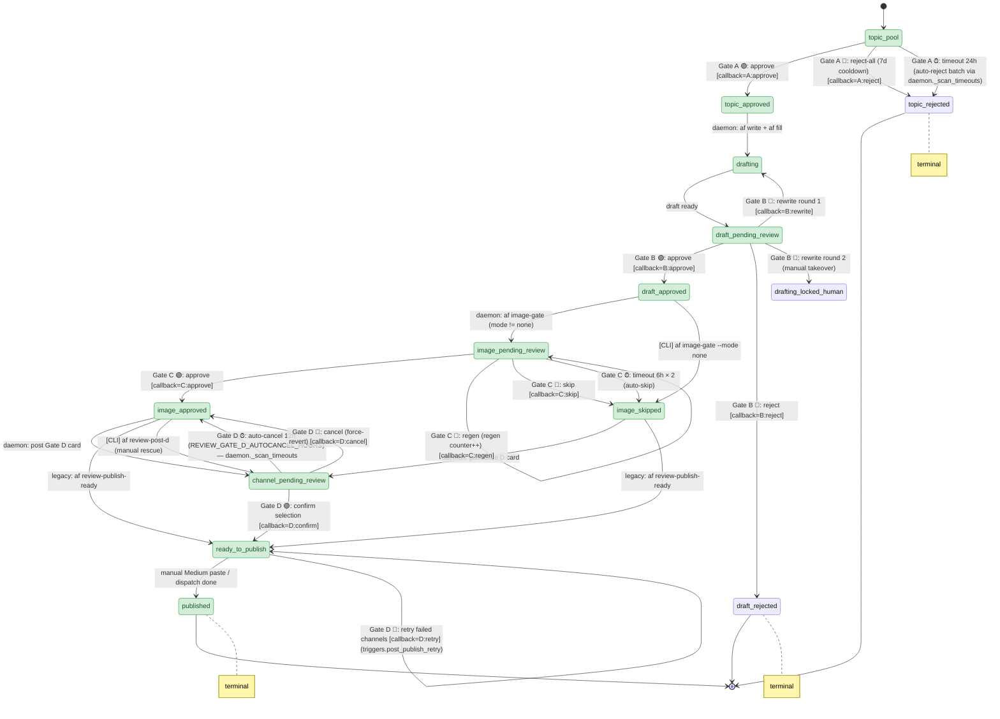

# Gate State Machine + Dependency Rules

The single source of truth is `metadata.json.status` (the existing field) plus
a new `metadata.json.gate_history` list that records every state transition.
The Telegram bot only reads & writes these — it does not maintain its own
parallel state.

## State diagram



Legacy direct edges `image_approved → ready_to_publish` and
`image_skipped → ready_to_publish` are still allowed so that
`af review-publish-ready` (the Medium-only CLI path) keeps working for
articles produced before Gate D existed.

## Sad-path transitions

| From state | Trigger | To state |
|------------|---------|----------|
| `topic_pool` | Gate A 🚫 全拒绝 | `topic_rejected` (7d cooldown) |
| `topic_pool` | Gate A timeout 24h | `topic_rejected` (auto-reject batch via daemon._scan_timeouts; no per-article state because hotspots have no article_id yet — batch entries are flagged `status=rejected_batch` in hotspots/<date>.json) |
| `draft_pending_review` | Gate B 🚫 拒绝 | `draft_rejected` (terminal) |
| `draft_pending_review` | Gate B 🔁 重写 (round 1) | `drafting` → back to `draft_pending_review` |
| `draft_pending_review` | Gate B 🔁 重写 (round 2) | `drafting_locked_human` (manual takeover) |
| `draft_pending_review` | Gate B timeout 12h | `draft_pending_review` + ping (no auto-degrade) |
| `image_pending_review` | Gate C 🔁 再生成 | `image_pending_review` (regen counter ++) |
| `image_pending_review` | Gate C 🚫 不用图 | `image_skipped` → Gate D |
| `image_pending_review` | Gate C timeout 6h × 2 | `image_skipped` (auto-fallback to no cover) |
| `channel_pending_review` | Gate D 🚫 Cancel | `image_approved` (force-revert; user can re-trigger) |
| `channel_pending_review` | Gate D ✅ Confirm with empty selection | (rejected with toast — no transition) |
| `channel_pending_review` | Gate D ✅ Confirm | `ready_to_publish` (after dispatch, even on partial fail) |
| `channel_pending_review` | Gate D timeout 12h (NEW) | `image_approved` (auto-cancel via `REVIEW_GATE_D_AUTOCANCEL_HOURS`) |
| `ready_to_publish` | Gate D 🔁 retry on dispatch summary (NEW) | `ready_to_publish` (re-runs only failed platforms via `triggers.post_publish_retry`) |
| `image_approved` | `[CLI] af review-post-d` (NEW) | `channel_pending_review` (manual rescue) |

## Dependency rules (front → back)

These are enforced by the daemon, not the bot:

1. **Gate A → Gate B is gated**: `af write` cannot fire until
   `metadata.status == topic_approved`. The daemon polls articles in
   `topic_approved` and queues fill jobs.

2. **Gate B → Gate C is gated**: `af image-gate` cannot fire until
   `metadata.status == draft_approved`. Image generation is expensive
   (Atlas billing), wasting it on a draft that gets rejected is the original
   pain point.

3. **Gate C → publish is gated**: `af preview` (with images) waits for
   `image_approved` OR `image_skipped`. If `image_skipped`, preview runs
   with `--skip-images`.

4. **Gate ordering must be linear** — no parallel gates. If two articles
   are in flight, each has its own state; gates do NOT skip.

5. **Backout is one-way per attempt**: a 🚫 reject moves the article into a
   terminal sad-path state. The user must explicitly run `af resume <id>` to
   put it back into a `*_pending_review` state. (CLI not yet implemented;
   tracked.)

## gate_history entry schema

Each transition appends an object:

```json
{
  "gate": "A" | "B" | "C",
  "from_state": "...",
  "to_state": "...",
  "actor": "human" | "daemon" | "self_check",
  "decision": "approve" | "reject" | "regen" | "edit" | "skip" | "defer" | "timeout",
  "timestamp": "2026-04-25T08:00:00+00:00",
  "tg_chat_id": 123456,
  "tg_message_id": 789,
  "callback_data": "B:approve:abc123",
  "round": 0,
  "notes": "free-form, optional"
}
```

This gives a complete audit trail — what was approved by whom and when, what
was rewritten, what was deferred. Useful for the `af report` command to
surface review velocity over time.

## Timeout daemon

A separate lightweight loop in the bot daemon scans articles in any
`*_pending_review` state every minute:

```python
for article in articles_with_pending_review():
    age = now() - article.last_gate_post_time
    if age > article.current_gate.timeout_hours:
        if article.current_gate.timeout_action == "ping":
            send_reminder(...)
            article.last_gate_post_time = now()  # don't ping again until next interval
        elif article.current_gate.timeout_action == "auto_skip":
            transition(article, "image_skipped")
        elif article.current_gate.timeout_action == "auto_reject_batch":
            # Gate A only: hotspots have no article_id yet, so we flag the
            # batch entries as rejected_batch in hotspots/<date>.json instead
            # of running a state.transition. See daemon._scan_timeouts and
            # the A:reject_all callback for the actual implementation.
            transition(article, "topic_rejected", force=True, decision="auto_reject_timeout")
```

## Gate D — channel selection

Gate D is implemented as the channel multi-select that fires after Gate C
(image_approved or image_skipped) and before `ready_to_publish`. The user
toggles which platforms to dispatch to; ✅ Confirm fires the actual
`af publish` (for non-medium adapters) and `af medium-package` (for the
manual paste step).

Default selection is read from
`metadata.metadata_overrides.gate_d.default_platforms`, falling back to
`["medium"]` when unset. Per-platform availability is probed at card-post
time against the env-var requirements documented in
`agentflow/agent_review/triggers.py::_PLATFORM_ENV_REQS`.

## Post-publish telemetry

`published` is the **terminal** state for the gate machine — no further
transitions. Engagement metrics (claps / likes / comments / RTs) are collected
out-of-band by `af review-publish-stats <article_id>`, which scrapes each
published platform best-effort and writes the result back to
`metadata.publish_stats.<platform>` (with the previous snapshot rotated into
`.history`, last 10 kept). The state machine never moves on a stats fetch;
this is a pure analytics layer. Recommended cron:

```
# every 6h, refresh stats for articles published in the last 14d
0 */6 * * *  af review-list --state published --since 14d \
    | xargs -n1 af review-publish-stats --json >>~/.agentflow/logs/stats.log
```

## Auxiliary gate actions

The following Gate buttons live alongside the primary review actions and are
fully wired through `daemon._route`. They do not advance the gate state
machine on their own; instead they surface extra context to the operator
(diff/full image), schedule a re-post, or mint follow-up image jobs.

| Gate | Action  | Rendered as       | Effect |
|------|---------|-------------------|--------|
| A    | `expand`  | "📋 全文"        | Reply with the full hotspot batch JSON |
| A    | `defer`   | "⏰ 4h 后"       | Schedule deferred Gate A re-post via deferred-repost store |
| B    | `diff`    | "📋 diff"        | Reply with `unified_diff(draft.md, medium_preview.md)` |
| B    | `defer`   | "⏰ 2h 后"       | Schedule deferred Gate B re-post |
| C    | `regen`   | "🔁 再生成"      | Re-spawn `af image-gate --mode cover-only` |
| C    | `relogo`  | "🎨 换 logo 位置"| Cycle `brand_overlay.anchor` and re-apply overlay |
| C    | `full`    | "🖼 全分辨率"    | Send the original 2k cover.png as a Telegram document |
| C    | `defer`   | "⏰ 2h 后"       | Schedule deferred Gate C re-post |
