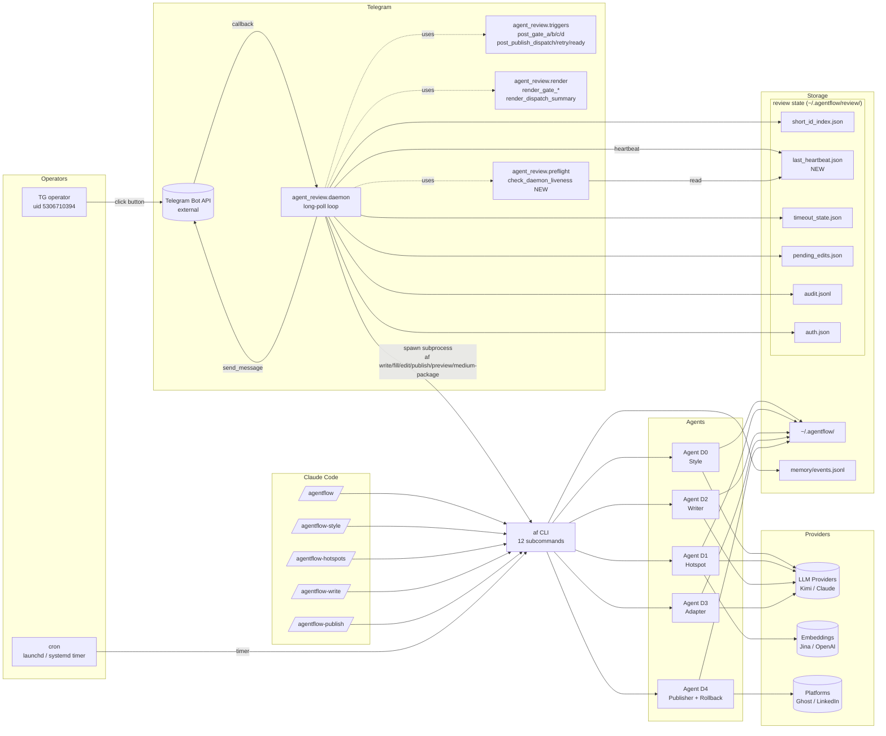

# AgentFlow Solution Overview

## 1. 文档目的

本文档从方案与实现视角总结 `agentflow-article-publishing` 当前系统：

- 它解决什么问题
- 当前用什么架构落地
- 为什么采用现在的设计
- 当前已做到哪里（含实 Key 验证边界）
- 下一阶段该如何演进

与 `docs/PRD_OVERVIEW.md` 的区别：PRD 关注“为什么做、做什么、下一步”，本文件关注“怎么做、怎么落地、哪些技术边界已被确认”。

## 2. Solution Summary

AgentFlow 当前是 **skill-first + `af` CLI + 本地文件系统** 的方案，**无 Web UI、无 HTTP 服务、无数据库**：

- **Skill-first**：唯一入口是 Claude Code 里的 5 个 skill（`.claude/skills/`），由 skill 调用 `af` CLI 完成重活
- **CLI 优先**：12 个 `af <subcommand>` 子命令覆盖 D0–D4 + rollback + memory tail
- **本地优先**：运行态数据全部落在 `~/.agentflow/`
- **Mock 优先**：`MOCK_LLM=true` 时可跑通全链路，无需任何真实 key
- **记忆分层**：单篇状态继续写 `metadata.json`，跨篇行为写 `memory/events.jsonl`

早期的 Next.js + FastAPI 形态已整体归档到 `_legacy/`，不再维护。

核心目标不是企业级复杂度，而是：在不引入数据库、消息队列、用户系统、Web 服务的前提下，把"内容发现 → 自动成稿 → 局部编辑 → 多平台发布 → 安全回滚"做成一条真实可用、完全在 Claude Code 里运行的工作流。

## 3. 产品目标到系统映射

| 产品目标 | 当前系统实现 |
|---|---|
| 从热点快速进入写作 | D1 (`af hotspots`) → skill 收集 `hotspot_id + angle` → D2 (`af write --auto-pick`) |
| 默认先拿到完整稿件 | `af write --auto-pick` 一次性 skeleton + `0/0/0` fill |
| 局部人工干预 | `af edit --section N [--paragraph M] --command "..."`；重选后 `af fill --title/opening/closing` |
| 多平台改写与发布 | D3 (`af preview`) → D4 (`af publish`)；`agentflow-publish` skill 分 8 步编排 |
| 发布前质量把关 | `agentflow-publish` Step 1b — lineage + references + compliance + platform readiness + hallucination flag |
| 撤稿/回滚 | `af publish-rollback [--post-id]`（Ghost DELETE） |
| 可恢复工作流 | `metadata.json` 单篇状态；`~/.agentflow/drafts/<aid>/` 作为恢复锚 |
| 记录用户偏好 | `~/.agentflow/memory/events.jsonl`（append-only，9 种事件） |
| 支持无 key 本地验证 | `MOCK_LLM=true` + fixtures + mock publish |

## 4. 核心设计原则

### 4.1 Skill 只编排，CLI 承载逻辑

所有生成 / 适配 / 发布 / 回滚逻辑都在 `af` CLI（Python），skill 只做：参数收集、调 CLI、解析 `--json` 输出、呈现给用户、在必要处追问。

原因：

- 让 CLI 对命令行用户、Claude Code 用户、未来 MCP 服务器都一致
- 让 skill 可以被读/被 review，不依赖代码路径
- mock 模式下 CLI 独立可跑，skill 依赖松

### 4.2 状态与记忆分离

- 单篇状态：`~/.agentflow/drafts/<article_id>/metadata.json`
- 跨篇行为：`~/.agentflow/memory/events.jsonl`

永远不往 `metadata.json` 里写"对所有文章通用的偏好"。

### 4.3 文件系统优先于数据库

当前系统没有引入数据库，用文件系统完成 MVP 持久化。

优点：可读、可调试、可手工检查、单用户本地工具无额外依赖。
代价：查询/索引受限、多端同步困难、并发写弱。

### 4.4 Mock 优先于实网耦合

- D0-D3 走 `agentflow/shared/mocks/` 的 fixtures
- D4 走 mock publishers（Ghost/LinkedIn/Medium publisher 各自短路）
- rollback 也支持 mock 短路（日志中标 `pretending to delete`）

这让所有 CI / 演示 / 文档示例可以不带 key 跑。

### 4.5 `--json` 契约：stdout 纯 JSON，log 走 stderr

所有 `af ... --json` 的 stdout 是纯 JSON。agent 调用、collector 进度、compliance 警告、SSL 错误等全部走 stderr。skill/脚本 pipe 时必须显式分流（`2>/dev/null` 或 `2>&1`）。

### 4.6 自动加载 `.env`

CLI 启动时自动查找 `backend/.env` 并加载（`_load_dotenv_once()`，不覆盖已存在的 env var）。这意味着：

- 用户不需要 `source .env` 也能跑
- 脚本里手动 export 仍然生效
- skill 里不用让用户记 "先 source"

## 5. 系统架构



（对比旧架构：没有 `API[FastAPI]`、没有 `UI[Next.js]`、没有 HTTP Surface；唯一 UX 是 5 个 skill。新图含 TG review 这一整层：operator entry / Telegram bot API / agent_review.{daemon,triggers,render,preflight} / review state stores，以及 cron 入口。）

## 6. 模块职责

### 6.1 Backend Agents（`backend/agentflow/`）

- `agent_d0` — 风格学习：读 .md / .docx / .txt / URL → per-article analyses → 聚合成 `style_profile.yaml`
- `agent_d1` — 热点发现：Twitter + RSS + HackerNews 采集 → DBSCAN 聚类（Jina embeddings） → Kimi 挖掘独立观点
- `agent_d2` — 写作：`skeleton_generator.py` + `section_filler.py` + `interactive_editor.py`；`compliance_checker.py` 做规则扫描（per-violation 0.15 扣分）
- `agent_d3` — 平台适配：`adapters/ghost.py` / `linkedin.py` / `medium.py`；段落拆分规则（Ghost 70w / LinkedIn 40w）；tag 抽取（本轮修头尾虚词剥离）
- `agent_d4` — 发布 + 回滚：`publishers/ghost.py` / `linkedin.py` / `medium.py`；Ghost publisher 含 `rollback(post_id)`；`GHOST_STATUS` env 可切 `draft/published/scheduled`

### 6.2 CLI (`backend/agentflow/cli/commands.py`)

12 个子命令：

| 命令 | 作用 | 写 memory |
|---|---|---|
| `learn-style` | D0 入口 | `learn_style` |
| `hotspots` | D1 完整 scan | — |
| `hotspot-show` | 单 hotspot 详情 | — |
| `write` | D2 skeleton +（可选）auto-fill | `article_created` + `fill_choices` |
| `fill` | 重新 fill 已存在 skeleton | `fill_choices` |
| `edit` | section/paragraph 自然语言编辑 | `section_edit` |
| `image-resolve` | 绑定本地图到 placeholder | `image_resolved` |
| `draft-show` | dump 现有 draft JSON | — |
| `preview` | D3 平台适配 | `preview` |
| `publish` | D4 发布 | `publish` |
| `publish-rollback` | D4 DELETE 已发 post | `publish_rolled_back` |
| `memory-tail` | 尾部 N 条 memory 事件 | — |
| `run-once` | D1 后交接（legacy） | — |

### 6.3 Skills（`.claude/skills/`）

| skill | 包装的 af 命令 | 关键步骤 |
|---|---|---|
| `agentflow` | — | 入口总览 / 路由 |
| `agentflow-style` | `learn-style` | D0 风格学习 |
| `agentflow-hotspots` | `hotspots`, `hotspot-show` | 选 hotspot + angle |
| `agentflow-write` | `write`, `fill`, `edit`, `image-resolve`, `draft-show` | 交互式写作循环 |
| `agentflow-publish` | `draft-show`, `image-resolve`, `preview`, `publish`, `publish-rollback` | 8 步 + Step 1b pre-publish overview |

## 7. 运行时数据模型

### 7.1 Runtime 目录

| Artifact | Path | Owner | Purpose |
|---|---|---|---|
| Style profile | `~/.agentflow/style_profile.yaml` | D0 | 风格基线 |
| Style corpus | `~/.agentflow/style_corpus/` | D0 | per-article analyses + 原文 |
| Sources | `~/.agentflow/sources.yaml` | 用户 | KOL / RSS / HN 配置 |
| Hotspots | `~/.agentflow/hotspots/YYYY-MM-DD.json` | D1 | 今日热点（含 source_references） |
| Draft markdown | `~/.agentflow/drafts/<id>/draft.md` | D2 | 正文 |
| Draft metadata | `~/.agentflow/drafts/<id>/metadata.json` | D2/D3/D4 | 单篇状态 |
| Draft skeleton | `~/.agentflow/drafts/<id>/skeleton.json` | D2 | 生成骨架 |
| Draft d3_output | `~/.agentflow/drafts/<id>/d3_output.json` | D3 | 平台适配结果 |
| Platform versions | `~/.agentflow/drafts/<id>/platform_versions/*.md` | D3 | 各平台最终文本 |
| Publish history | `~/.agentflow/publish_history.jsonl` | D4 | 每次发布/回滚一行（含 `platform_post_id`） |
| Memory events | `~/.agentflow/memory/events.jsonl` | CLI | 跨篇行为（append-only） |
| Logs | `~/.agentflow/logs/agentflow.log` + `llm_calls.jsonl` | shared | 调试 |

### 7.2 单篇状态机

```
approved → skeleton_ready → draft_ready → preview_ready → published
                                                                │
                                                                ▼
                                                          (rollback)
                                                                │
                                                                ▼
                                                         preview_ready
```

rollback 全部平台后 `status=preview_ready`、`published_at` 清空、`published_platforms` 空。

### 7.3 记忆事件模型

```json
{
  "schema_version": 1,
  "ts": "2026-04-24T...Z",
  "event_type": "article_created | fill_choices | section_edit | hotspot_review | preview | publish | publish_rolled_back | learn_style | image_resolved",
  "article_id": "...",
  "hotspot_id": "...",
  "payload": { /* event-specific */ }
}
```

第一阶段只做"记录"，Phase 1 将加"消费"（见 §13）。

### 7.4 Publish history 行 schema

```json
{
  "article_id": "...",
  "platform": "ghost_wordpress | linkedin_article | medium",
  "status": "success | failed | skipped | rolled_back | rollback_failed",
  "published_url": "...",
  "platform_post_id": "...",
  "published_at": "ISO8601",
  "failure_reason": "..."
}
```

`platform_post_id` 是本轮新加字段；没有它 rollback 没法定位 Ghost post。

## 8. 关键流程

### 8.1 风格学习（D0 / `/agentflow-style`）

1. 用户把 3-5 篇样稿放到 `samples/`（或任意目录）
2. `af learn-style --dir samples/`
3. D0 并发读文件 → per-article prompts → Kimi 分析 → 聚合 → 写 `style_profile.yaml`
4. 写 `learn_style` memory event

### 8.2 热点到自动成稿（D1 + D2 / `/agentflow-hotspots` + `/agentflow-write`）

1. `af hotspots --json` → 拉 Twitter/RSS/HN → Jina 聚类 → Kimi 挖 angles → 写 `hotspots/<date>.json`
2. 用户选 `hotspot_id + angle_index`
3. `af write <hid> --auto-pick --json` → 生成 skeleton → 立即 `0/0/0` fill → 落盘 draft + metadata
4. 写 `article_created` + `fill_choices`

### 8.3 局部人工编辑（D2 / `/agentflow-write`）

1. `af edit <aid> --section N [--paragraph M] --command "改短"`
2. D2 interactive_editor 读旧 section + 命令 → Kimi 重写 → 覆盖 draft 对应 section
3. 写 `section_edit`

### 8.4 预览 → overview → 发布（D3 + D4 / `/agentflow-publish`）

1. **Step 1** `af draft-show --json` → 数 sections/words/unresolved images
2. **Step 1b** (关键) 读 `metadata.json` + hotspot 文件 + `platform_versions/*.md` front-matter + env → 产出 lineage / topic / references / compliance / tags / platforms 预览；对齐不上 refs 的中心论点打 hallucination 标
3. **Step 2** 图片 resolve 或 strip
4. **Step 3** `af preview <aid> --json` → D3 产出 `platform_versions/*.md`
5. **Step 4** 展示平台预览首 30 行
6. **Step 5** 用户确认（yes / 部分平台 / cancel）
7. **Step 6** `af publish <aid> [--platforms csv] [--force-strip-images] --json`（`GHOST_STATUS` 控制 Ghost 发布状态）
8. **Step 7** 表格输出每平台 status + URL / reason
9. **Step 8** close message + 提示 memory event 已写

### 8.5 回滚（`af publish-rollback`）

1. skill 识别用户意图（"撤下" / "undo" / "删掉刚才那篇"）
2. 确认 + 找 `platform_post_id`（先从 history 最新 success 记录；找不到让用户 `--post-id` override）
3. `af publish-rollback <aid> [--post-id X]` → Ghost DELETE → 204 视为成功
4. 写 `publish_rolled_back` + history `status=rolled_back` 行
5. `metadata.json` 的 `published_platforms` 移除此平台；若全空，`status=preview_ready`

## 9. 配置与凭证策略

### 9.1 Mock 模式（默认）

- `.env` 或 shell 里 `MOCK_LLM=true`
- 全链路走 fixtures，零外呼

### 9.2 Real-key 模式

生成层（二选一）：

- `MOONSHOT_API_KEY` + `GENERATION_PROVIDER=kimi` ★ 推荐（OpenAI-compat，中文友好）
- `ANTHROPIC_API_KEY` + `GENERATION_PROVIDER=claude`

Embeddings（二选一）：

- `JINA_API_KEY` + `EMBEDDING_PROVIDER=jina` ★ 推荐（10M 免费 token）
- `OPENAI_API_KEY` + `EMBEDDING_PROVIDER=openai`

D1 采集（可选）：

- `TWITTER_BEARER_TOKEN` — 无则只用 RSS + HN

D4 发布（按平台启用）：

- `GHOST_ADMIN_API_URL` + `GHOST_ADMIN_API_KEY`（格式 `<24hex>:<hex_secret>`）★ v0.1 主平台
- `LINKEDIN_ACCESS_TOKEN` + `LINKEDIN_PERSON_URN`（需用户手动 OAuth，30-60min）
- `MEDIUM_INTEGRATION_TOKEN` — deprecated，2025-01-01 后不能新申请

控制变量：

- `GHOST_STATUS=draft|published|scheduled`（默认 `published`）
- `MOCK_LLM=true|false`
- `D1_DBSCAN_EPS` / `D1_DBSCAN_MIN_SAMPLES` / `D1_VIEWPOINT_CONCURRENCY`

### 9.3 `.env` 自动加载

CLI 启动时 `_load_dotenv_once()` 从 `backend/.env` 加载；`os.environ` 已有的不覆盖。

## 10. 当前验证状态（2026-04-24）

### 已完成 — mock 端到端

| 步骤 | 命令 | 结果 |
|---|---|---|
| D1 | `MOCK_LLM=true af hotspots --json` | 5 hotspots ✓ |
| D2 | `MOCK_LLM=true af write <hid> --auto-pick --json` | draft 齐全 ✓ |
| D3 | `MOCK_LLM=true af preview <aid> --json` | 2 平台 md ✓ |
| D4 | `MOCK_LLM=true af publish <aid> --force-strip-images --json` | 2 平台 success ✓ |
| Rollback | `MOCK_LLM=true af publish-rollback <aid>` | mock 短路 OK ✓ |

### 已完成 — 实 Key 端到端

| 阶段 | Provider | 结果 |
|---|---|---|
| D0 | Moonshot Kimi | 2 样本 → 6 analyses → 新 profile ✓ |
| D1 | Twitter + Jina + Kimi | 244 signals → 8 clusters → 8 hotspots ✓ |
| D2 | Kimi K2.6 | skeleton + 1812 字 draft ✓ |
| D3 | Kimi K2.6 | Ghost + LinkedIn md ✓ |
| D4 Ghost | Ghost Admin API | 2 次 draft 发布成功 ✓ |
| Rollback Ghost | Ghost DELETE | 2 次 204 成功，API probe 返回 404 ✓ |
| D4 LinkedIn | — | ❌ token 未配，stable fail |

### 已完成 — Skill 集成

- `agentflow-publish` SKILL.md 含 Rollback section
- `agentflow-publish` Step 1b 在真实文章上 dry-run 成功，暴露 "量子纠缠" 标题 vs 全是 Vitalik 谈 substrate independence 的 refs 的不一致（hallucination flag 生效）

### 未验证 / 缺口

- LinkedIn OAuth → 实 Key smoke（需用户）
- 图片支路（`image-resolve`）→ 真实文章触发（当前文章都 `image_placeholders=0`）
- `af run-once` 实 Key（只跑过 mock）
- 其余 4 个 skill 的 CLI 变化对齐（`agentflow` / `-style` / `-hotspots` / `-write`）

## 11. API Surface（已废弃）

原 FastAPI 路由层整体归档到 `_legacy/api/`。任何外部系统需要与 AgentFlow 交互，当前方式：

1. 直接调 `af` CLI（推荐；覆盖 100% 功能）
2. 读 `~/.agentflow/` 下的文件（只读集成；快）
3. 未来考虑 MCP server wrap `af`（not yet）

`_legacy/tests/test_p1_api.py` 仍在仓库里用于历史回归，但不再跟随主路径跑。

## 12. 风险与技术债

### 12.1 记忆层只有日志，没有消费层
已记录 9 种事件，Phase 1 要加 `preferences.yaml` + `af prefs-show/explain`。见 §13。

### 12.2 文件存储适合 MVP，不适合高并发
单用户本地工具不会命中。远程/多用户需要重做。

### 12.3 长耗时任务仍是同步
Kimi + 4 section fill 约 60-90s；实 Key D1 scan 约 45-60s。当前 skill 同步等；用户能接受。未来要 task 化。

### 12.4 Kimi 段落长度 overshoot
Prompt 明确约束 ≤N 字，但 Kimi 稳定产 140-180 字段。D3 adapter 会做平台级二次拆分，compliance 分数作为信号不阻塞。本轮回滚了 "降 max_length_words 到 130" 的尝试，因为只会让分数更低不改生成。

### 12.5 Ghost SSL 偶发握手失败
`SSL: UNEXPECTED_EOF_WHILE_READING` 至少命中两次（publish 和 rollback 各一次）。已加 `RequestException` 兜底。用户偶尔会看到 network error，retry 即可。

### 12.6 Real-key readiness 只有部分检查
Step 1b 读 env 判断 "哪些平台会 skip"，但没有真正的 "credential health" 探测（比如 token 是否过期）。

### 12.7 Rollback 仅限 Ghost
LinkedIn API 不支持程序化 delete，Medium 已 deprecated。这是 API 层边界，不是实现边界。

## 13. 推荐演进路线

### Phase 1（近期，本轮已策划见独立文档）

- **Memory → Default Strategy**
  - 消费 `fill_choices / section_edit / publish` → 输出 `preferences.yaml`
  - Phase 1 切片：让第 N+1 次 `af write` 默认选上次的 title/opening/closing index；`af preview` 默认选上次 publish 成功的平台集合
  - 可解释：每个默认值带 "based on N past runs" 的注释
- **LinkedIn OAuth + 实 Key smoke**
  - 用户手动走一次 developer app OAuth（30-60min）
  - 实 Key publish 一篇，回滚文档
- **图片素材策略实现**（见独立策略 MEMO）
  - D2.5 阶段插 `[IMAGE:]` placeholder
  - 图源：本地图库 + 生成 + 从 reference 抓

### Phase 2

- 后台任务 / 进度反馈
- `af draft-revert <aid> --to <rev>` 版本回退
- Credential health CLI：`af doctor`

### Phase 3

- 记忆解释面板 / `af prefs-explain`
- 远程存储 / 多端
- 协作审核

## 14. 结论

本轮（2026-04-24）完成的结构性动作：

1. **形态跃迁**：从 Next.js + FastAPI 收敛为 skill-first + `af` CLI；旧形态整体归档到 `_legacy/`
2. **实 Key 主链路打通**：D0/D1/D2/D3/D4(Ghost) 全绿，含两次真实发布 + 两次真实回滚 + API probe 404 确认
3. **安全网落地**：`publish-rollback` 命令 + publish_history 补 `platform_post_id` + `publish_rolled_back` 事件
4. **质量把关标准化**：Step 1b pre-publish overview（lineage + references + compliance + platform readiness + hallucination flag），真实 dry-run 已抓出一次 hallucination

下一阶段**不应重新发明主流程**，而是：

- 让 memory 真正反哺默认策略
- 让 LinkedIn + 图片两条支路收尾
- 让 Phase 1 的 `preferences.yaml` 可解释
