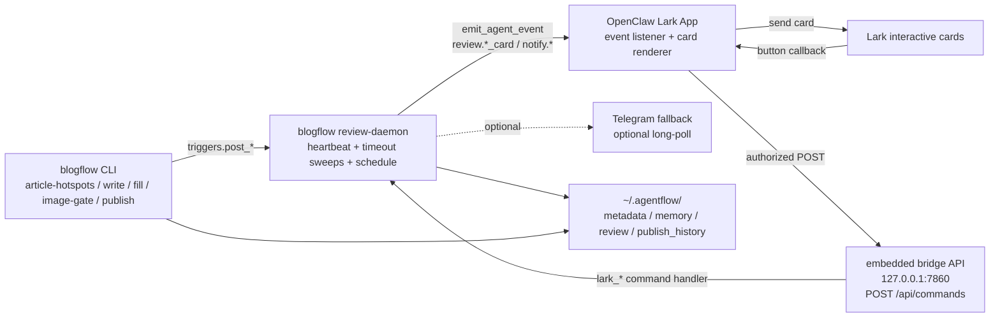
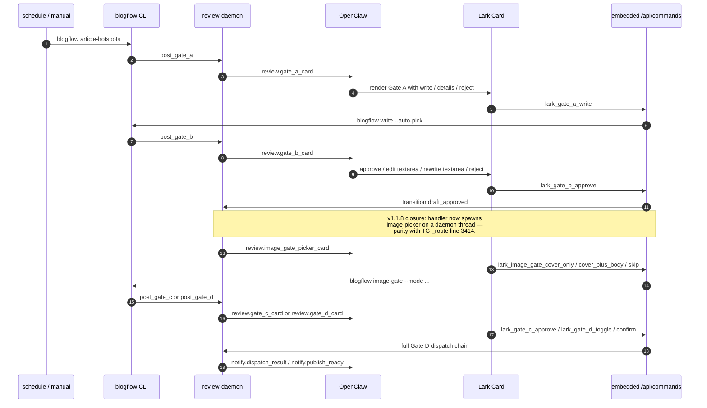
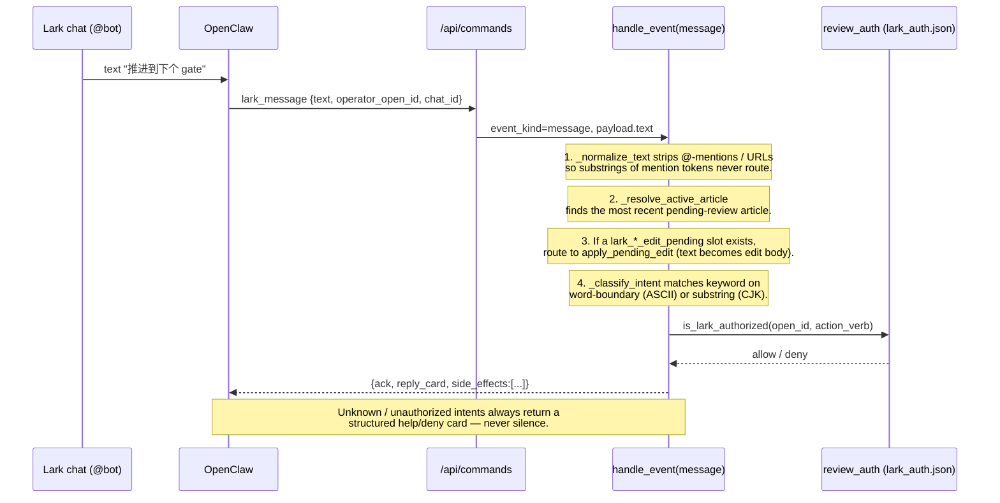

# Lark-First Review Flows

本文件是当前 Lark / OpenClaw 主链路的流程图和场景闭环参考。旧
`TG_BOT_FLOWS.md` 保留 Telegram fallback 的内部 callback / timeout
细节；Lark-first 部署、OpenClaw card callback、daemon-owned bridge 以本文
为准。

## 1. Runtime Topology



Direction matters:

- `AGENTFLOW_AGENT_EVENT_WEBHOOK_URL` is outbound from AgentFlow to OpenClaw.
- OpenClaw card callbacks are inbound to
  `http://127.0.0.1:7860/api/commands` by default.
- `blogflow review-dashboard` is a standalone debug/read runner, not the
  primary Lark callback process.

## 2. Gate Flow



## 3. Scenario Closure Matrix

| 场景 | Lark 主入口 | 输入框 | 后端命令 / 状态 | 闭环标准 |
|---|---|---|---|---|
| Gate A 选题 | `review.gate_a_card` | 无 | `lark_gate_a_write` → `blogflow write --auto-pick` | 成功后发 Gate B；失败发 `notify.spawn_failure` |
| Profile setup | `review.profile_setup_card` | `payload.answer` | `lark_profile_setup_answer` / `lark_profile_setup_skip` | 写 profile session 并继续下一题 |
| Gate B 草稿 | `review.gate_b_card` | `comment/edit_text/prompt/text` | approve → image picker；edit → `blogflow edit --post-review`；rewrite/refill → `blogflow fill` | 新稿回 Gate B；无输入时注册一次性 pending edit |
| Image picker | `review.image_gate_picker_card` | `prompt/cover_description/text` | `blogflow image-gate --mode cover-only|cover-plus-body|none` | cover 模式发 Gate C；skip 直接 Gate D |
| Gate C 图片 | `review.gate_c_card` | `feedback/cover_description/prompt/text` | approve/skip → Gate D；regen → `blogflow image-gate --cover-description` | 图片重生后回 Gate C，或通过后进入 Gate D |
| Gate D 渠道 | `review.gate_d_card` | 无 | toggle/select_all/save_default/confirm/cancel/extend | confirm 跑完整 dispatch chain，不是裸 publish |
| Locked takeover | `review.locked_takeover_card` | `comment/edit_text/prompt/text` | critique/edit/give_up | critique 只读；edit 后回 Gate B；give_up terminal |
| Publish ready / result | `notify.publish_ready` / `notify.dispatch_result` | mark URL 走 PR/TG fallback 或 CLI | `blogflow review-publish-mark` | publish_history + metadata.published_url 一致 |

## 4. Free-text @-mention path (v1.1.8)

When an operator @-mentions the bot in a Lark group with free text instead of
clicking a card button, OpenClaw posts the message as a `lark_message`
command. The daemon classifies the intent deterministically — keyword first,
no LLM — and routes to the same handler the corresponding button would have
fired. This kills the v1.1.7 hallucination class where the Lark-side LLM
client invented fake "Gate B 完成" replies because the daemon silently
ignored every text event.



**Intent matrix (deterministic — see `_INTENT_TABLE` in
`backend/agentflow/agent_review/lark_callback.py`):**

| Operator says | Routed action | Required auth |
|---|---|---|
| `通过` / `approve` / `✅` | `approve_b` (or state-aware via `推进`) | `review` |
| `拒绝` / `驳回` / `reject` | `reject_b` | `review` |
| `重写` / `rewrite` | `gate_b_rewrite` | `edit` |
| `编辑 ...` / `edit ...` | `gate_b_edit` (text becomes the comment) | `edit` |
| `refill` / `重新填充` | `refill` | `review` |
| `推进到下个 gate` / `advance` | state-aware: → `approve_b` (B) / `gate_c_approve` (C) / help (D) / `locked_critique` (L) | per target |
| `audit` / `查 audit` / `diff` | `gate_b_diff` | `review` |
| `通过封面` / `跳过封面` / `重新生成封面` | `gate_c_*` | `review` / `image` |
| `确认发布` | `gate_d_confirm` | `publish` |
| `取消发布` | `gate_d_cancel` | `review` |
| anything else | structured help card | n/a |

**Pending-edit priority:** when a `lark_edit_pending` event exists for the
operator + active article, ANY non-empty text bypasses intent classification
and becomes the edit body. The slot is consumed (a
`lark_pending_edit_consumed` event is appended), so a second @-mention won't
re-fire.

## 5. Lark-side authorization (v1.1.8)

Parity with TG's per-action auth (`daemon._ACTION_REQ` + `auth.is_authorized`):

- Implicit operator: env `LARK_OPERATOR_OPEN_ID` (mirrors
  `TELEGRAM_REVIEW_CHAT_ID`). Operator implicitly has `["*"]`.
- Allowlist file: `~/.agentflow/review/lark_auth.json` with shape
  `{"authorized_open_ids": [{"open_id":"ou_xxx","name":"...","allowed_actions":["review","edit"]}]}`.
- Action verbs reuse the existing vocabulary: `review`, `write`, `edit`,
  `image`, `publish`, `system`, `*`.
- (gate, action) → required-verb map lives in `_LARK_ACTION_REQ` in
  `lark_callback.py` and matches `_ACTION_REQ` in `daemon.py`.
- Backward-compat: if `LARK_OPERATOR_OPEN_ID` is unset AND the allowlist
  file is empty, the gate is open (no break for fresh installs that
  haven't onboarded a Lark operator yet). Production deployments should
  set the env first.

## 6. chat_id plumbing (v1.1.8)

OpenClaw must include `chat_id` in `lark_message` and card-callback param
bodies. The daemon threads it into `operator.chat_id`, into telemetry
payloads (`memory.events.jsonl::lark_callback`), and onto downstream
`notify.*` events emitted by trigger functions. Subscribers can pick the
chat_id off any event in this chain to target the originating Lark chat
for the next-gate card, rather than always falling back to a default.

## 7. Auto fan-out (v1.1.8 closure)

| Triggering action | Auto-spawned next card | TG parity reference |
|---|---|---|
| `lark_gate_b_approve` | `image_gate_picker` | `daemon._route` line ~3414 |
| `lark_gate_c_approve` | `gate_d` | `daemon._route` line ~3453 |
| `lark_gate_c_skip` | `gate_d` | `daemon._route` line ~3473 |
| `lark_image_gate_skip` | `gate_d` (already in-process) | n/a |

Spawned via `_spawn_next_gate_card` in a daemon thread so the bridge
response stays fast.

## 8. Required OpenClaw Rendering Contract

OpenClaw should render `review.*_card` as interactive review cards and render
`notify.*` only as broadcast/status cards. Do not infer Gate A from
`notify.hotspots_digest`.

Button callback body:

```json
{
  "request_id": "lark-card-callback-id",
  "command": "lark_gate_b_edit",
  "article_id": "article-or-hotspot-id",
  "params": {
    "payload": {
      "comment": "operator instruction"
    },
    "operator": {
      "id": "open_id",
      "name": "operator name"
    }
  }
}
```

The detailed per-card field contract lives in
`backend/agentflow/agent_review/templates/lark_review_cards.md`.

## 9. Verification Checklist

- `blogflow doctor` shows Lark-first checks healthy.
- `AGENTFLOW_LARK_APP_PRIMARY=true`.
- `AGENTFLOW_AGENT_EVENT_WEBHOOK_URL` points to OpenClaw, not back to the daemon.
- `AGENTFLOW_AGENT_BRIDGE_TOKEN` is configured on both OpenClaw and AgentFlow.
- `AGENTFLOW_AGENT_BRIDGE_ENABLE_DANGEROUS=true` is set when cards need to run
  write/edit/image/publish commands.
- `blogflow review-daemon` is running and exposes `/api/commands` on
  `AGENTFLOW_REVIEW_BRIDGE_HOST:AGENTFLOW_REVIEW_BRIDGE_PORT`.
- `LARK_WEBHOOK_URL` legacy Custom Bot is disabled unless intentionally used
  for non-review broadcast fallback.
- `LARK_OPERATOR_OPEN_ID` is set (v1.1.8). Without it, any open_id is
  authorized by default — fine for staging, **must be set in prod**.
- `~/.agentflow/review/lark_auth.json` lists the per-operator action grants
  matching `~/.agentflow/review/auth.json` for TG.
