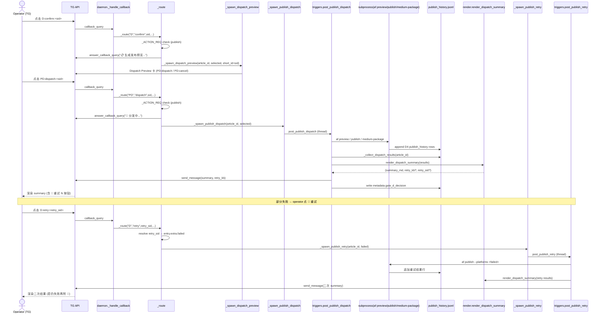

# TG Bot Flows

本文件覆盖 `backend/agentflow/agent_review/` 下 review daemon 的内部调用图：从 TG 入站事件 / 内部 timer / CLI subprocess 触发，到 `_route` 分发、各 `_spawn_*` helper 落到 `triggers.post_*` 与子进程，再到出站 TG 消息与磁盘副作用。源文件：`daemon.py` / `triggers.py` / `render.py`。

## 1. Daemon 事件路由总览

```mermaid
flowchart TD
    %% --- event sources ---
    TGmsg["TG update.message<br/>/start /help /list[/all/filter] /cancel /suggestions<br/>edit-reply 文本"]
    TGcb["TG callback_query<br/>A:* B:* C:* D:* PD:* I:* L:* PR:* P:* S:*"]
    Tloop["run loop<br/>poll_interval≈5s"]
    Theartbeat["_write_heartbeat<br/>每轮 poll"]
    Ttimeout["_scan_timeouts<br/>每 60s"]
    CLI["CLI subprocess<br/>af hotspots/fill/image-gate<br/>review-post-b/c/d<br/>review-publish-stats"]

    %% --- daemon dispatch ---
    Hmsg["_handle_message<br/>daemon.py"]
    Hcb["_handle_callback<br/>daemon.py"]
    Route["_route<br/>daemon.py<br/>(_ACTION_REQ auth gate)"]
    PendEdit["pending_edits.take<br/>edit-reply 路径"]
    ProfReply["_maybe_handle_profile_session_reply"]

    %% --- spawn helpers (threading.Thread + subprocess.run) ---
    SWrite["_spawn_write_and_fill<br/>subprocess: af write --auto-pick"]
    SRewrite["_spawn_rewrite<br/>subprocess: af fill"]
    SEdit["_spawn_edit<br/>subprocess: af edit"]
    SPubReady["_spawn_publish_ready"]
    SGateD["_spawn_gate_d"]
    SImage["_spawn_image_gate"]
    SPreview["_spawn_dispatch_preview"]
    SDispatch["_spawn_publish_dispatch"]
    SRetry["_spawn_publish_retry"]
    SMark["_spawn_publish_mark"]

    %% --- triggers (post_*) ---
    TPostA["triggers.post_gate_a"]
    TPostB["triggers.post_gate_b"]
    TPostC["triggers.post_gate_c"]
    TPostD["triggers.post_gate_d"]
    TPostReady["triggers.post_publish_ready"]
    TPostDisp["triggers.post_publish_dispatch"]
    TPostRetry["triggers.post_publish_retry"]

    %% --- outbound ---
    TGapi["tg_client<br/>send_message / send_photo /<br/>answer_callback_query /<br/>edit_message_reply_markup"]
    AFsub["subprocess.run(_af_argv ...)<br/>preview / publish / medium-package"]

    %% wires: events
    TGmsg --> Hmsg
    TGcb --> Hcb
    Tloop --> Theartbeat
    Tloop --> Ttimeout
    Tloop --> Hmsg
    Tloop --> Hcb
    CLI --> TPostA
    CLI --> TPostB
    CLI --> TPostC
    CLI --> TPostD

    %% wires: msg branches
    Hmsg -->|/start /help /list /cancel /suggestions| TGapi
    Hmsg -->|profile setup| ProfReply
    Hmsg -->|pending edit-reply| PendEdit --> SEdit

    %% wires: callback branches
    Hcb --> Route
    Route -->|A:write| SWrite
    Route -->|B:rewrite| SRewrite
    Route -->|B:edit| PendEdit
    Route -->|B:approve / reject| TGapi
    Route -->|C:approve / skip| SGateD
    Route -->|C:regen / I:cover_only / I:cover_plus_body / I:none| SImage
    Route -->|C:relogo| TGapi
    Route -->|D:toggle / select_all / clear_all / save_default| TGapi
    Route -->|D:confirm| SPreview
    Route -->|PD:dispatch| SDispatch
    Route -->|D:cancel / PD:cancel / D:extend| TGapi
    Route -->|D:resume| SGateD
    Route -->|D:retry| SRetry
    Route -->|PR:mark reply URL| SMark
    Route -->|P:start P:later| ProfReply
    Route -->|S:review S:apply S:dismiss| TGapi

    %% wires: timeout sweeper
    Ttimeout -->|B 12h/24h ping| TGapi
    Ttimeout -->|C 12h auto-skip| SGateD
    Ttimeout -->|D 12h auto-cancel + D:extend button| TGapi

    %% wires: spawn -> triggers
    SGateD --> TPostD
    SImage --> AFsub
    SPreview --> TGapi
    SDispatch --> TPostDisp
    SRetry --> TPostRetry
    SMark --> TGapi
    SPubReady --> TPostReady
    SWrite --> AFsub
    SRewrite --> AFsub
    SEdit --> AFsub

    %% wires: triggers -> outbound
    TPostA --> TGapi
    TPostB --> TGapi
    TPostC --> TGapi
    TPostD --> TGapi
    TPostReady --> AFsub
    TPostReady --> TGapi
    TPostDisp --> AFsub
    TPostDisp --> TGapi
    TPostRetry --> AFsub
    TPostRetry --> TGapi

    %% --- side effects ---
    subgraph SE["side effects (~/.agentflow/)"]
        FHB["review/last_heartbeat.json"]
        FTO["review/timeout_state.json"]
        FSID["review/short_id_index.json"]
        FAUD["review/audit.jsonl"]
        FPE["review/pending_edits.json"]
        FMETA["drafts/<id>/metadata.json"]
        FPH["publish_history.jsonl"]
    end
    Theartbeat --> FHB
    Ttimeout --> FTO
    Route --> FSID
    Route --> FAUD
    Hmsg --> FAUD
    Hcb --> FAUD
    PendEdit --> FPE
    TPostDisp --> FMETA
    TPostDisp --> FPH
    TPostRetry --> FPH
```

关键节点说明：`run` 循环每轮先调 `_write_heartbeat` 落 `last_heartbeat.json`（外部健康检查可读），再 `get_updates` 拉 TG 长轮询；消息走 `_handle_message`，回调走 `_handle_callback → _route`。`_handle_message` 的 slash 命令必须排在 `pending_edits.take()` 之前，避免 `/list` / `/help` / `/cancel` 被编辑回复会话吞掉。`_route` 第一步过 `_ACTION_REQ` 做 per-action auth（`review/write/edit/image/publish`）；通过后按 `gate:action` 分发，重活一律 `_spawn_*` 推到后台线程或 `subprocess.run(_af_argv(...))`。当前已上线路由包括：`D:confirm → _spawn_dispatch_preview → PD:dispatch → _spawn_publish_dispatch`，`D:retry:<retry_sid>` 从 short_id extra 取 failed 列表，`D:extend` 处理 Gate D 超时救援，`I:none` 复用 `af image-gate --mode none` 后投 Gate D。`_scan_timeouts` 每 60s 扫一次 `*_pending_review`：Gate B 12h/24h 双 ping、Gate C 12h auto-skip 后再 `_spawn_gate_d`、Gate D 12h auto-cancel 回 `image_approved` 并附 `[⏰ 再延 12h]`。

### `/list` 移动端导航（S7）

当前代码实现：`/list` 是只读快照，默认列 `draft_pending_review` / `image_pending_review` / `channel_pending_review` / `ready_to_publish` 四类可处理卡片，按 B/C/D/Ready 标签输出短 article_id + title；空结果返回 `✨ no pending cards`。

S7 已上线的移动端导航能力：`/list` 与 `/list all` 显示四类默认视图；`/list B`、`/list C`、`/list D`、`/list ready`、`/list publish` 支持大小写不敏感过滤；未知参数返回帮助提示；最多展示 20 条并提示剩余数量；audit 记录 `kind=slash_command, cmd=/list, filter, total`，便于排查“为什么列表里没有某篇文章”。

## 2. Dispatch + Retry 时序

发布与重试语义：`D:confirm` 只生成 Dispatch Preview，不直接真发；`PD:dispatch` 才进入 D4 发布。每一次 dispatch / retry 都重新读 `publish_history.jsonl` 计算 per-platform 状态；只要还有 `failed`，`render_dispatch_summary` 注册新的 `D:retry` short_id（TTL 12h，`extra.failed` 保存失败平台），retry 不做 state transition、不重发 medium-package、只针对 `failed` 列表跑一次 `af publish`。

## 3. 文件副作用速查

| 文件 | 写入者 | 用途 |
|---|---|---|
| `~/.agentflow/review/last_heartbeat.json` | `_write_heartbeat`（每轮 poll） | daemon 存活探针 |
| `~/.agentflow/review/timeout_state.json` | `_scan_timeouts` 经 `timeout_state.mark_*` | B/C/D 超时去重，避免重复 ping |
| `~/.agentflow/review/short_id_index.json` | `_sid.register / set_extra / revoke / gc` | callback short_id ↔ entry，含 D 的 `selected/failed` |
| `~/.agentflow/review/audit.jsonl` | `_audit`（callback / message / spawn / timeout 全程） | 取证用 append-only 审计流 |
| `~/.agentflow/review/pending_edits.json` | `pending_edits.register / take` | B:edit 等待用户下一条文字回复 |
| `~/.agentflow/drafts/<id>/metadata.json` | `triggers.post_publish_dispatch` | 写 `gate_d_decision`（platforms_selected / results） |
| `~/.agentflow/publish_history.jsonl` | `af publish`（被 dispatch/retry 调用） | D4 publish_history schema（全局单文件，见 `agent_d4/storage.py:13`），retry summary 据此重算 |

## 4. 引用代码位置（cursor 接续用）

> 行号会漂移，接续时只 grep 符号名。

- `daemon._write_heartbeat`: `backend/agentflow/agent_review/daemon.py`
- `daemon._handle_message`: `backend/agentflow/agent_review/daemon.py`
- `daemon._handle_callback`: `backend/agentflow/agent_review/daemon.py`
- `daemon._ACTION_REQ`: `backend/agentflow/agent_review/daemon.py`
- `daemon._route`: `backend/agentflow/agent_review/daemon.py`
- `daemon._spawn_rewrite`: `backend/agentflow/agent_review/daemon.py`
- `daemon._spawn_edit`: `backend/agentflow/agent_review/daemon.py`
- `daemon._spawn_publish_ready`: `backend/agentflow/agent_review/daemon.py`
- `daemon._spawn_gate_d`: `backend/agentflow/agent_review/daemon.py`
- `daemon._spawn_image_gate`: `backend/agentflow/agent_review/daemon.py`
- `daemon._spawn_dispatch_preview`: `backend/agentflow/agent_review/daemon.py`
- `daemon._spawn_publish_dispatch`: `backend/agentflow/agent_review/daemon.py`
- `daemon._spawn_publish_retry`: `backend/agentflow/agent_review/daemon.py`
- `daemon._spawn_publish_mark`: `backend/agentflow/agent_review/daemon.py`
- `daemon._spawn_write_and_fill`: `backend/agentflow/agent_review/daemon.py`
- `daemon.run`: `backend/agentflow/agent_review/daemon.py`
- `daemon._scan_timeouts`: `backend/agentflow/agent_review/daemon.py`
- `triggers.post_gate_a`: `backend/agentflow/agent_review/triggers.py`
- `triggers.post_gate_b`: `backend/agentflow/agent_review/triggers.py`
- `triggers.post_publish_ready`: `backend/agentflow/agent_review/triggers.py`
- `triggers.post_gate_c`: `backend/agentflow/agent_review/triggers.py`
- `triggers.post_image_gate_picker`: `backend/agentflow/agent_review/triggers.py`
- `triggers.post_gate_d`: `backend/agentflow/agent_review/triggers.py`
- `triggers.post_dispatch_preview`: `backend/agentflow/agent_review/triggers.py`
- `triggers.post_publish_dispatch`: `backend/agentflow/agent_review/triggers.py`
- `triggers.post_publish_retry`: `backend/agentflow/agent_review/triggers.py`
- `triggers.mark_published`: `backend/agentflow/agent_review/triggers.py`
- `render.render_gate_d`: `backend/agentflow/agent_review/render.py`
- `render.render_dispatch_preview`: `backend/agentflow/agent_review/render.py`
- `render.render_dispatch_summary`: `backend/agentflow/agent_review/render.py`
