# AgentFlow User Scenarios

从 operator（Telegram 单人值守）视角抽出的 13 个端到端场景泳道图。每图 5 列：Operator / Cron / Daemon / subprocess(CLI) / External（Atlas/Telegram/Medium/...）。后续"场景补充 + 优先级拆分"以本图为基底。

> 优先级标签未填，留空给 reviewer：`[P0 critical]` 流程闭环必备 / `[P1 productivity]` 日常省时间 / `[P2 polish]` 边缘 case。

---

# S0 — Initialization Phase

S0 series covers everything that has to happen ONCE before S1 (起稿) can fire. Reviewed scenario by scenario; only S0.1 painted in this revision; S0.2-S0.7 added as each one is reviewed.

---

## Scenario S0.1 — Skill harness 安装 & 加载  `[P_]`

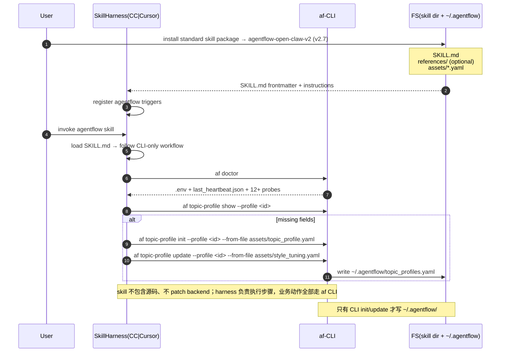

最新可交付包：`.cursor/skills/agentflow-open-claw-v2/`（v2.7），可分发 zip 为 `dist/agentflow-open-claw-v2.7.zip`。Skill 包采用标准结构：`SKILL.md` 放触发条件、工作流和 CLI 调用顺序；`references/` 可放长文档；`assets/` 放 YAML 模板/风格调节参数。默认入口按首次部署 / 初始化续跑处理，先检查 runtime repo、venv、`.env`、`~/.agentflow/`，再进入 `af bootstrap` / `af onboard` / `af doctor`。包内不放项目源码，避免 harness 执行偏离预期时改到实现代码，也降低安装体积。OpenClaw/Cursor/Claude Code 只作为 skill harness 负责加载与执行指令，不需要再为 skill 单独启动守护进程；Telegram review daemon 属于后续业务运行面，不是 S0.1 的安装依赖。

---

## Scenario S0.2 — Backend 安装 + .env 起步  `[P_]`

非 mermaid 场景。完整步骤见 `INSTALL.md` 顶部 5-Minute Mock Quickstart + Install steps（Step 1-8）。要点：venv 创建 → `pip install -e .` (deps 已 sync 到 pyproject.toml) → cp .env.template .env → `af bootstrap` 一站式起手 → `af doctor` 验。

---

## Scenario S0.3 — `af onboard` 凭据向导  `[P_]`

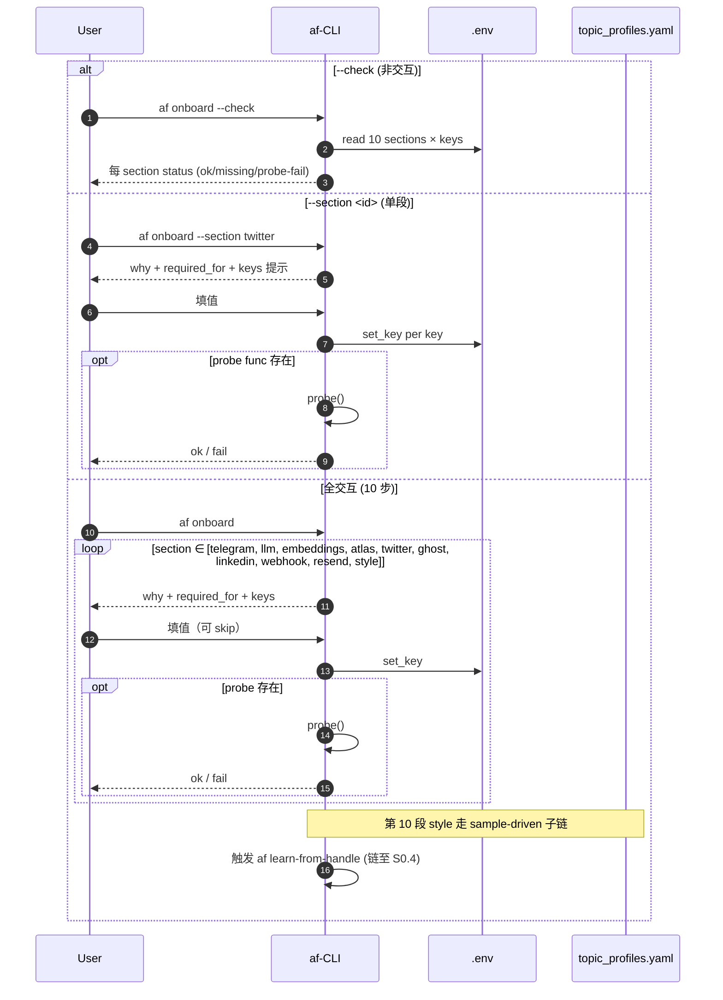

注解（≤50 字）：S0.3 是 env 凭据层（10 sections）；业务 profile（topic / publisher_account）走 S0.4 + topic-profile 9 命令，互不重叠。

---

## Scenario S0.4 — Style 导入 (`af learn-style` / `af learn-from-handle`)  `[P_]`

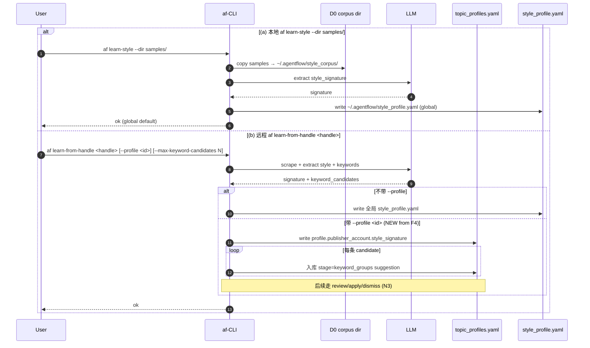

注解（≤50 字）：(a) 全局 style；(b) 远程双输出—signature 直写 profile + keywords 入 suggestion 流（接 N3）。

---

## Scenario 1 — 起稿（Hotspot → Gate A → 起稿 #N）  `[P_]`

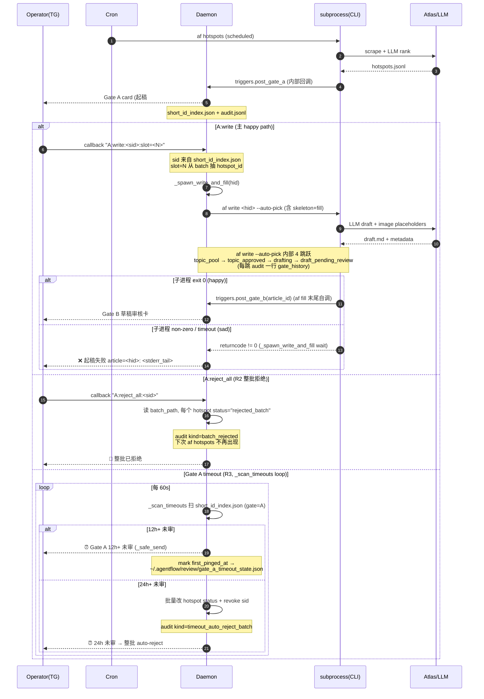

Trigger: cron `af hotspots` → CLI 内部 trigger `post_gate_a` → state 进入 `topic_pool`（每个 hotspot 一条）→ `A:write:<sid>:slot=<N>` callback 后 daemon → `_spawn_write_and_fill(hid)` → `af write --auto-pick` 子进程在内部 4 跳：topic_pool → topic_approved → drafting → draft_pending_review。`A:reject_all`：batch 内每 hotspot status=rejected_batch（不动 article state）。Gate A timeout：12h ping / 24h auto-reject batch（同 reject_all 行为）。失败模式：spawn 子进程非 0 → daemon 发 TG "❌ 起稿失败" 含 stderr tail（不再 silent）。

---

## Scenario 2 — 草稿审核（Gate B：✅/✏️/🔁/🚫）  `[P_]`

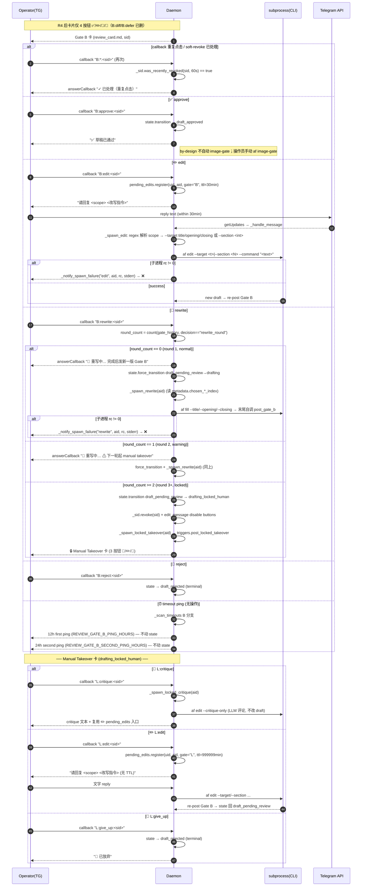

States: `draft_pending_review` → `{draft_approved | draft_rejected | drafting (rewrite round 1-2) | drafting_locked_human (rewrite round 3+)}`。drafting_locked_human → {draft_pending_review (after L:edit) | draft_rejected (L:give_up)}。round 计数从 gate_history 里 decision=="rewrite_round" 的条数推导（不新加 metadata 字段）。✏️ pending_edits 30min TTL；L:edit 永久 TTL（即丢失会话的"丢就丢，再点 ✏️"在 round 3+ 不适用）。12h/24h ping 不动 state；spawn 失败 → daemon 发 ❌ 通知；callback 双击 → "已处理(重复点击)"。

---

## Scenario 3 — 封面审核（Gate C：✅/🔁/🎨/🚫）  `[P_]`

```mermaid
sequenceDiagram
    autonumber
    participant Op as Operator(TG)
    participant Daemon
    participant CLI as subprocess(CLI)
    participant Ext as Atlas
    Note over Daemon,Op: ── 入口路径（3 选 1）──
    alt (a) Gate B ✅ 后 picker 卡
        Daemon-->>Op: 📸 选择封面策略卡 (3 按钮)
        alt 💎 I:cover_only (默认)
            Op->>Daemon: callback "I:cover_only:<sid>"
            Daemon->>Daemon: _spawn_image_gate(aid, "cover-only")
        else 🎨 I:cover_plus_body
            Op->>Daemon: callback "I:cover_plus_body:<sid>"
            Daemon->>Daemon: _spawn_image_gate(aid, "cover-plus-body")
        else 🚫 I:none
            Op->>Daemon: callback "I:none:<sid>"
            Daemon->>Daemon: state→image_skipped + _spawn_gate_d (绕 Gate C, 同 S13)
        end
        Note over Daemon: 不强制校验 — 用户可忽略卡片直接 CLI
    else (b) operator CLI: af image-gate <aid> --mode cover-only|cover-plus-body
        Op->>CLI: af image-gate <aid> --mode cover-only
        CLI->>Ext: Atlas image gen
        Ext-->>CLI: cover.png + metadata
    else (c) operator CLI: af image-gate <aid> --mode none
        Op->>CLI: af image-gate <aid> --mode none
        Note over CLI: 直接 image_skipped + post_gate_d (绕 Gate C, S13 详)
    end
    CLI->>Daemon: triggers.post_gate_c(aid)
    alt cover blocker (cover_path missing)
        Daemon->>Daemon: self_check.check_gate_c → blockers
        Note over Daemon: log warning + 直接 return None, 不发卡
    else cover OK
        Daemon-->>Op: Gate C 卡 (cover preview + 4 按钮 ✅/🔁/🎨/🚫)
        Note over Daemon: state → image_pending_review<br/>caption 标 brand_overlay ON/off
        alt soft-revoke replay
            Op->>Daemon: 重复点击 / TG 重发
            Note over Daemon: was_recently_revoked(sid, 60s) → "✓ 已处理(重复点击)"
        else ✅ approve
            Op->>Daemon: callback "C:approve:<sid>"
            Daemon->>Daemon: state→image_approved + revoke + _spawn_gate_d
        else 🔁 regen
            Op->>Daemon: callback "C:regen:<sid>"
            Daemon->>Daemon: _spawn_image_gate(aid, "cover-only")
            Note over Daemon: 重跑 Atlas → 新 cover.png → 自动重发 Gate C 卡
        else 🎨 relogo
            Op->>Daemon: callback "C:relogo:<sid>"
            Daemon->>Daemon: _spawn_relogo(aid)
            Note over Daemon: 仅 cycle brand_overlay anchor，不重跑 Atlas → 重发 Gate C 卡
        else 🚫 skip
            Op->>Daemon: callback "C:skip:<sid>"
            Daemon->>Daemon: state→image_skipped + revoke + _spawn_gate_d
        end
    end
    loop _scan_timeouts 每 60s
        alt 6h+ 未审 (REVIEW_GATE_C_PING_HOURS)
            Daemon-->>Op: ⏰ Cover 6h+ 未审 (first ping; 不动 state)
        else 12h+ 未审 (REVIEW_GATE_C_AUTOSKIP_HOURS)
            Daemon->>Daemon: state→image_skipped (force=True, decision=auto_skip_timeout)
            Daemon->>Daemon: _spawn_gate_d
            Daemon-->>Op: ⏰ Cover 12h 未审 → 自动 fallback 到无封面，state→image_skipped
        end
    end
```

States: `draft_approved` (entry) → `image_pending_review` (Gate C 卡发出) → `{image_approved | image_skipped}`，**两者都自动 spawn Gate D**。入口 3 选 1：(a) Gate B ✅ 后 picker 卡（不强制；可忽略）；(b) CLI `af image-gate --mode cover-only/cover-plus-body`；(c) CLI `af image-gate --mode none` 绕 Gate C 直接 image_skipped。Gate C 卡含 4 按钮（✅/🔁/🎨/🚫；R4 后无 stub）。🔁 regen 真重跑 Atlas（_spawn_image_gate）；🎨 relogo 仅 cycle brand_overlay anchor，不重跑 Atlas（_spawn_relogo）。Timeout：6h ping 不动 state；12h auto-skip + spawn Gate D。失败：cover blocker → 跳 post 不发卡；soft-revoke → "已处理(重复点击)"。`af doctor` 第 13 项可诊 Atlas key 状态。

---

## Scenario 4 — 渠道选择（Gate D：toggle + Confirm）  `[P_]`

```mermaid
sequenceDiagram
    autonumber
    participant Op as Operator(TG)
    participant Daemon
    Daemon->>Daemon: _spawn_gate_d(aid) [from image_approved | image_skipped]
    Daemon->>Daemon: triggers._detect_available_platforms(aid) (env 过滤; 全无→fallback ['medium'])
    Daemon->>Daemon: 读 metadata.metadata_overrides.gate_d.default_platforms (不在 available 里→fallback)
    Daemon->>Daemon: triggers.post_gate_d(aid) → 新 sid
    Daemon-->>Op: Gate D 卡 (available × toggle + [⚡全选/✖全清/💾保存默认] + [✅Confirm/🚫Cancel])
    Note over Daemon: state → channel_pending_review; selected 持久化到 _sid.extra.selected
    loop callback (toggle / 快捷 / save_default)
        alt 重复点击 (was_recently_revoked < 60s)
            Daemon-->>Op: alert "✓ 已处理(重复点击)"
        else ☑ D:toggle (auth=review)
            Op->>Daemon: callback "D:toggle:<sid>:p=<plat>"
            Daemon->>Daemon: selected ^= {plat}
            Daemon->>Daemon: _sid.set_extra(sid, "selected", sorted(selected))
            Daemon-->>Op: edit_message_reply_markup (新 kb)
        else ⚡ D:select_all (auth=review)
            Op->>Daemon: callback "D:select_all:<sid>"
            Daemon->>Daemon: selected = set(available)
            Daemon->>Daemon: _sid.set_extra(sid, "selected", sorted(selected))
            Daemon-->>Op: edit_message_reply_markup (新 kb)
        else ✖ D:clear_all (auth=review)
            Op->>Daemon: callback "D:clear_all:<sid>"
            Daemon->>Daemon: selected = set()
            Daemon->>Daemon: _sid.set_extra(sid, "selected", [])
            Daemon-->>Op: edit_message_reply_markup (新 kb)
        else 💾 D:save_default (auth=review)
            Op->>Daemon: callback "D:save_default:<sid>"
            Daemon->>Daemon: 读 sid.extra.selected
            Daemon->>Daemon: 写 metadata.metadata_overrides.gate_d.default_platforms
            Daemon-->>Op: "✅ 已保存为默认 (下次 Gate D 自动勾选)"
            Note over Daemon: 不动 state, 不影响 confirm 流程
        end
    end
    alt ✅ D:confirm (auth=publish)
        Op->>Daemon: callback "D:confirm:<sid>"
        alt 空选
            Daemon-->>Op: alert "请至少选一个渠道"
            Note over Daemon: 不动 state
        else 非空选
            Daemon->>Daemon: _spawn_dispatch_preview(aid, selected)
            Daemon->>Daemon: triggers.post_dispatch_preview
            Daemon-->>Op: 📋 Dispatch Preview 卡 (per-platform 信息 + [🚀 PD:dispatch / 🚫 PD:cancel])
            Note over Daemon: 不动 state, 等 PD:* 二次确认
            alt 🚀 PD:dispatch (auth=publish)
                Op->>Daemon: callback "PD:dispatch:<sid>"
                Daemon->>Daemon: _spawn_publish_dispatch(aid, selected) [async thread]
                Daemon->>Daemon: triggers.post_publish_dispatch → state→ready_to_publish (S5)
            else 🚫 PD:cancel (auth=review)
                Op->>Daemon: callback "PD:cancel:<sid>"
                Daemon->>Daemon: state.transition force → image_approved (同 D:cancel 路径)
            end
        end
    else 🚫 D:cancel (auth=review)
        Op->>Daemon: callback "D:cancel:<sid>"
        Daemon->>Daemon: state.transition force → image_approved
        Daemon->>Daemon: clear original keyboard + send_message "🚫 已取消 · article=<aid>" [🔄 恢复 Gate D]
        Note over Daemon: audit kind=callback, action=cancel, article_id 记录;<br/>resume 使用新 D-sid，原 sid soft-revoke
        alt 🔄 D:resume (auth=review)
            Op->>Daemon: callback "D:resume:<sid>"
            Daemon->>Daemon: 读 sid.extra.article_id (sid 仍在 index, soft-revoked)
            Daemon->>Daemon: triggers.post_gate_d(aid) (新 sid + 新卡)
            Note over Daemon: state 已回 image_approved, post_gate_d 推 channel_pending_review
        end
    end
    loop _scan_timeouts 每 60s (cross-ref S12)
        alt 12h+ 未审 (Gate D)
            Daemon->>Daemon: 自动 cancel: state→image_approved force
            Daemon-->>Op: ⏰ Gate D 12h 未确认 → auto-cancel · article=<aid> [⏰ 再延 12h]
            alt 🕒 D:extend (auth=review, max 1 次/article)
                Op->>Daemon: callback "D:extend:<sid>"
                Daemon->>Daemon: timeout_state.extended_count += 1; clear first/second timeout markers
                Daemon->>Daemon: state.transition force → channel_pending_review (回退 auto-cancel)
                Daemon->>Daemon: _spawn_gate_d(aid) 重发新卡
                Daemon-->>Op: "✅ 已延 12h, 重新计时"
            end
        end
    end
```

States: 入口 4 路（C:approve / C:skip / 12h auto-skip / af review-post-d）→ `image_approved | image_skipped` → daemon `_spawn_gate_d` → `channel_pending_review`。Gate D 卡按钮：每 available 平台 1 toggle 行（按 `_PLATFORM_ENV_REQS` env 过滤）+ 快捷行 [⚡ 全选 / ✖ 全清 / 💾 保存默认] + 行 [✅ Confirm / 🚫 Cancel]。selection 持久化在 `short_id_index.json::extra.selected`（重启 daemon 不丢）。`D:confirm` → preview confirm 链（先发 📋 Dispatch Preview 卡 → 再 `PD:dispatch` 真发布 OR `PD:cancel` 退回）；不再"立即发布"。`D:cancel` → 清原卡 keyboard + 另发 [🔄 恢复 Gate D] 消息，可重发卡。Timeout: 12h auto-cancel ping 附 [⏰ 再延 12h] 按钮（max 1 次/article）；`D:extend` 复用 `timeout_state.json::extended_count` 并清 timeout markers 后重发 Gate D。Per-action auth：D:confirm 要 `publish`，PD:dispatch 要 `publish`，其他 `review`。空选 confirm → alert 不动 state。Soft-revoke "✓ 已处理(重复点击)"。

---

## Scenario 5 — 多渠道发布执行（dispatch + retry kb）  `[P_]`

```mermaid
sequenceDiagram
    autonumber
    participant Op as Operator(TG)
    participant Daemon
    participant CLI as subprocess(CLI)
    participant FS as FS(.agentflow)
    participant Ext as Platforms (medium/ghost_wordpress/linkedin_article/twitter_thread/twitter_single/webhook)
    Op->>Daemon: callback "PD:dispatch:<sid>" (来自 S4 Preview 卡 真发布按钮)
    Daemon->>Daemon: ETA = 30 + 60×N_non_medium + 30×linkedin + 20×twitter + 30×medium
    Daemon-->>Op: ⏳ 分发中... 预计 ~Ns (N 平台 ETA, 上云后实际可能浮动)
    Daemon->>CLI: af preview <aid> --platforms <csv> (timeout 180s, 产 platform_versions/<X>.md)
    alt preview exit != 0
        Daemon-->>Op: ❌ preview 失败, dispatch aborted (含 stderr 末尾)
        Note over Daemon: state 不动; 用户可重新点 PD:dispatch 或 D:cancel
    else preview OK
        Daemon->>Daemon: auto_platforms = platforms - {medium}
        Daemon->>Daemon: timeout = min(300 + 200 × len(auto_platforms), 1800)
        Daemon->>CLI: af publish --platforms <auto_csv> (timeout 自适应; 6 平台=1500s, 1 平台=500s, 上限 30min)
        loop per platform sequential (per-publisher)
            CLI->>Ext: POST article/tweets (ghost_wordpress / linkedin_article / twitter_*)
            Ext-->>CLI: 201 url | 5xx error
        end
        CLI-->>Daemon: publish_history.jsonl appended
        Daemon->>Daemon: triggers._collect_dispatch_results(aid, auto_platforms)
        opt medium in platforms
            Daemon->>CLI: af medium-package (timeout 120s)
            alt package.md 不存在 (1st)
                Daemon->>CLI: af medium-package (retry 1 次, timeout 120s, label="medium-package-retry")
                alt package.md 仍不存在 (2nd)
                    Daemon->>Daemon: _notify_spawn_failure("medium-package", aid, "missing after retry")
                    Note over Daemon: results.append(medium, status="missing_after_retry")
                else package.md 存在 (2nd)
                    Note over Daemon: results.append(medium, status="manual") (retry 成功)
                end
            else package.md 存在 (1st)
                Note over Daemon: results.append(medium, status="manual")
            end
            Daemon->>Daemon: triggers.post_publish_ready(aid) (S6 入口 cross-ref)
        end
        Daemon->>FS: metadata.gate_d_decision = {platforms_selected, dispatched_at, results}
        Daemon->>Daemon: state.transition force → STATE_READY_TO_PUBLISH (即便部分失败)
        Daemon->>Daemon: render.render_dispatch_summary(results)
        alt all success (failed_count == 0)
            Note over Daemon: 摘要顶部加 "🎉 全部 N 平台成功"
        else 有失败
            Daemon->>FS: short_id_index.json: register retry sid (gate=D, ttl=12h, extra.failed=[...])
            Note over Daemon: 摘要末尾附 🔁 retry kb (failed only)
        end
        Daemon->>Daemon: estimated_len = len(summary_md)
        alt 摘要超长 (estimated_len > 3500)
            Daemon-->>Op: ℹ 摘要超长 ({estimated_len} 字), 完整结果见附件 (前置通知)
            Daemon->>FS: 写 ~/.agentflow/drafts/<aid>/dispatch_results.json (完整 results)
            Daemon-->>Op: 摘要 (truncate per-platform reason 到 100 字)
            Daemon->>Op: send_document dispatch_results.json
        else 摘要长度安全
            Daemon-->>Op: 摘要 (含完整 reason, ✅/❌ per platform)
        end
    end
```

States: `channel_pending_review` (PD:dispatch 入口) → `ready_to_publish` (post-dispatch force, 即便部分失败)；published 在 manual mark 后 (S6)。Side effects: `~/.agentflow/publish_history.jsonl`、`metadata.gate_d_decision`（落 platforms_selected / dispatched_at / results audit trail）、`metadata.publish_results`、可能 `dispatch_results.json` (摘要超长时)。Preview 失败阻断 publish (Q2)；入口 ETA 通知 (Q3, 自适应按平台数+特定平台 weight 算)；publish timeout 自适应 = min(300 + 200 × N_auto, 1800s)；medium-package missing 重试 1 次后 _notify_spawn_failure；全成功 "🎉" 标语；摘要超长 truncate + dispatch_results.json send_document attach（生成前 send_message 提示）。retry sid (gate=D, ttl=12h, extra.failed=[...]) 写 short_id_index.json。Soft-revoke "已处理(重复点击)"。

---

## Scenario 6 — Medium 手工粘贴回环  `[P_]`

```mermaid
sequenceDiagram
    autonumber
    participant Op as Operator(TG)
    participant Daemon
    participant CLI as subprocess(CLI)
    participant FS as ~/.agentflow
    Note over Daemon: medium 不走 API by-design；human-in-the-loop
    alt (a) S5 dispatch 含 medium → 自动 post_publish_ready
        Note over Daemon: 来自 S5 _spawn_publish_dispatch
    else (b) operator 手工救援
        Op->>CLI: af review-publish-ready <aid>
        CLI->>Daemon: triggers.post_publish_ready(aid)
    end
    Daemon->>CLI: af preview --platforms medium (timeout 120s)
    alt preview exit != 0
        Daemon-->>Op: ❌ preview 失败 (Q4 _notify_spawn_failure)
    else preview OK
        Daemon->>CLI: af medium-package (timeout 60s)
        alt medium-package exit != 0 或 package.md missing
            Daemon-->>Op: ❌ medium-package 失败 / missing (Q4)
        else OK
            Daemon->>FS: 读 export.json (title/subtitle/tags/canonical/warnings/cover_path)
            Daemon->>Daemon: render.render_publish_ready (caption: title+subtitle+tags+canonical+warnings)
            alt cover_path 存在
                Daemon-->>Op: send_photo cover + caption + send_document package.md + [📌 我已粘贴]
            else cover_path 缺
                Daemon-->>Op: send_message caption + send_document package.md + [📌 我已粘贴]
            end
            Daemon->>Daemon: state→ready_to_publish (force, idempotent)
        end
    end
    Note over Op: operator 浏览器 paste → 发布 → 取 URL
    alt 入口 (a) TG 按钮 (Q6 新)
        Op->>Daemon: callback "PR:mark:<sid>"
        Daemon->>Daemon: pending_edits.register(uid, aid, gate=PR, ttl=999999min)
        Daemon-->>Op: "📌 请回复 URL"
        Op->>Daemon: 文字 reply (URL)
        Daemon->>Daemon: _handle_message takes pending → URL 校验 (http/https)
        Daemon->>Daemon: triggers.mark_published(aid, url, platform="medium")
    else 入口 (b) CLI
        Op->>CLI: af review-publish-mark <aid> <url> [--platform medium]
        CLI->>CLI: triggers.mark_published(aid, url) (URL 校验; 不经 daemon)
    end
    alt Q3 dedupe: 已 STATE_PUBLISHED 且 platform 已在 published_platforms
        Daemon-->>Op: ⚠ 已 mark 过 medium, 不重复 append (audit warn)
        Note over Daemon: 不动 publish_history / metadata
    else 新增
        Daemon->>FS: append_publish_record (status=success) → publish_history.jsonl
        Daemon->>FS: meta.published_platforms.append(medium)
        Daemon->>FS: meta.published_url[medium] = url (Q5a dict)
        Daemon->>FS: meta.status="published", meta.published_at=now
        Daemon->>Daemon: state→STATE_PUBLISHED (force, idempotent)
        Daemon-->>Op: "📌 *Published* · medium\n*<title>*\n<url>\n\narticle_id: <aid>"
    end
    Note over Daemon,FS: Q5a: D4 publisher 真发布后 (S5 末) 也自动写 published_url[plat] dict
    opt Q5c 增量发布 (已 published 后再发其他渠道)
        Op->>CLI: af review-post-d <aid> (N5 救援)
        CLI->>Daemon: triggers.post_gate_d(aid)
        Daemon->>Daemon: filter available - already_published_platforms
        Daemon->>Daemon: STATE_PUBLISHED → STATE_CHANNEL_PENDING_REVIEW (Q5c 新边, force)
        Daemon-->>Op: Gate D 卡 (only 未发渠道 toggle) → 走 S5 dispatch
    end
    opt Q2 每日 digest (不强提醒)
        loop _scan_timeouts 每 60s
            alt now - timeout_state.last_digest_at >= 24h
                Daemon->>FS: state.articles_in_state([STATE_READY_TO_PUBLISH]) filter 老于 24h
                Daemon->>Daemon: render.render_publish_digest
                Daemon-->>Op: "📌 N 篇待 publish-mark:\n• <id> — <title>"
                Daemon->>FS: timeout_state.last_digest_at = now (复用 storage)
            end
        end
    end
```

States: 入口 2 路：(a) S5 dispatch 含 medium 自动；(b) `af review-publish-ready` 救援。post_publish_ready: preview→medium-package→render→send_photo+caption+document，每步失败 _notify_spawn_failure (Q4)。Manual paste：(a) TG `[📌 我已粘贴]` 按钮 + reply URL（Q6 新；pending_edits gate=PR）；(b) CLI `af review-publish-mark <url>`（不经 daemon，直接 send_message）。dedupe (Q3): 已 published 同平台拒绝重复 append。auto URL 回报 (Q5a): D4 publisher 真发布后自动写 metadata.published_platforms + published_url[plat] dict。增量发布 (Q5c): STATE_PUBLISHED → STATE_CHANNEL_PENDING_REVIEW 新边；post_gate_d filter 已发平台。每日 digest (Q2): 24h 一次列 ready_to_publish 老于 24h 文章；用 timeout_state.last_digest_at 复用 storage（不强提醒）。导出 (Q5b): `af medium-package` 在 ready_to_publish / published 都可调（无 state 限制；已存在）。失败模式：operator 忘 mark → 卡 ready_to_publish（非 medium_pending_manual），digest 暴露。

---

## Scenario 7 — 移动端导航 `/list` + `/published` + `/scan` + `/jobs`  `[P_]`

> S7 implemented. `/list` 已作为移动端只读导航入口，覆盖 B/C/D/Ready，支持常用 gate 过滤与长列表截断；`/published [days]` 提供最近 N 天 published 快照（含 age + 前 3 platform）；新增 `/scan [top-k]` 主动触发 hotspots、`/jobs` 只读 cron 状态。

```mermaid
sequenceDiagram
    autonumber
    participant Op as Operator(TG)
    participant Daemon
    participant State as metadata/state
    participant FS as drafts/*/metadata.json
    participant Audit as review/audit.jsonl
    alt 默认 pending 视图
        Op->>Daemon: send "/list"
        Daemon->>Daemon: parse scope=pending, filter=None
        Daemon->>State: articles_in_state([B_pending, C_pending, D_pending, ready_to_publish])
    else 全库视图
        Op->>Daemon: send "/list all"
        Daemon->>Daemon: parse scope=all
        Daemon->>State: scan drafts/*/metadata.json
    else 条件过滤
        Op->>Daemon: send "/list B|C|D|ready|publish"
        Daemon->>Daemon: parse gate filter (case-insensitive)
        Daemon->>State: articles_in_state(filtered states)
    else /published [days]
        Op->>Daemon: send "/published" or "/published 30"
        Daemon->>Daemon: parse days (1-90, default 7)
        Daemon->>State: articles_in_state(STATE_PUBLISHED)
        Daemon->>FS: 读 metadata.published_at + published_url[plat] dict
        Daemon->>Daemon: filter age <= days, sort by recency, cap 20
        Daemon-->>Op: "📌 Published — 最近 7d · N 篇\n• <aid> — <title> (3d on medium,ghost)"
    else /scan [top-k] (主动触发 hotspots)
        Op->>Daemon: send "/scan" or "/scan 5"
        Daemon->>Daemon: parse top-k (1-10, default 3)
        Daemon-->>Op: "⏳ 主动扫描 hotspots 中..."
        Daemon->>Daemon: _spawn_hotspots(top_k) → subprocess af hotspots
        Note over Daemon: 子进程跑完自动 trigger post_gate_a → Gate A 卡
        Note over Daemon: 失败 → _notify_spawn_failure
    else /jobs (cron 定时任务状态)
        Op->>Daemon: send "/jobs"
        Daemon->>Daemon: _run_subprocess(af review-cron-status)
        Daemon-->>Op: "⏰ Cron 定时任务 (launchd)<br/>plist/status/launchctl 输出"
        Note over Daemon: 仅只读, 不动 cron 配置
    end
    Daemon->>Daemon: _handle_message → cmd dispatch
    Daemon->>Daemon: group by state/gate, sort newest activity first; rows append age_h `(Nh+/Nd+)`
    Daemon->>Daemon: truncate rows for Telegram mobile safety
    Daemon-->>Op: markdown list + total/matched/filter summary
    Daemon->>Audit: append kind=slash_command cmd=/list|/published filter/days/total
```

只读快照；不 transition state。上线行为：`/list` / `/list all` 默认覆盖 B/C/D pending + `ready_to_publish`；`/list B`、`/list C`、`/list D`、`/list ready`、`/list publish` 支持按 gate/state 过滤；未知参数返回帮助提示。移动端最多展示 20 条，末尾提示剩余数量；audit 记录 filter/total。空结果回 `✨ no pending cards`。每行末尾附 `gate_history` 末条 timestamp 推算的 pending 时长 `(Nm+/Nh+/Nd+)`，>24h 自动切换到 `Nd+` 单位。

`/published [N]` 默认 7d，max 90d（超界回错误提示）；按 `metadata.published_at` 过滤、按 recency 排序，显示 `<aid> — <title> (<age> on <platforms>)`，platform 取前 3，超出加 `…`；> 20 篇 truncate 并在 header 标 `(前 20)`；空结果回 `📭 最近 Nd 无 published 文章`。

`/scan [N]` 主动 hotspots 扫描（不等 cron，default top-3 max 10）：daemon spawn `af hotspots --gate-a-top-k N` 子进程（300s timeout），CLI 跑完自动 trigger `post_gate_a` 推 Gate A 卡；失败由 `_notify_spawn_failure` 兜底。`/jobs` 只读 cron 状态（调 `af review-cron-status` 文本输出，仅 macOS / launchd；用 `af review-cron-{install,uninstall}` 改）。

---

## Scenario 8 — Daemon 健康度（af doctor）  `[已上线]`

> 已核对代码：`daemon._write_heartbeat()` 每轮 poll 写 `~/.agentflow/review/last_heartbeat.json`；`preflight.check_daemon_liveness()` 已挂入 `preflight.all_checks()`，并由 `af doctor` 调用。

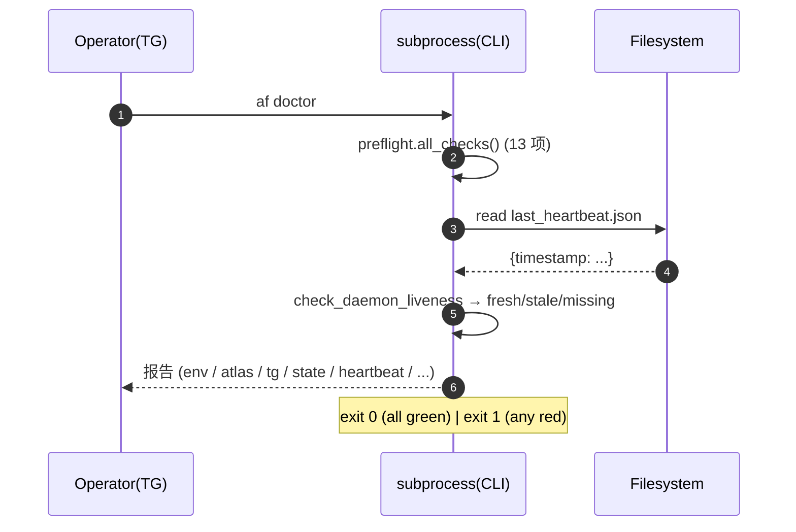

上线行为：Heartbeat 阈值 `stale_seconds=120.0` (≈2min)，`missing` 表示文件不存在；`stale` 表示 daemon 超过阈值未刷新。其他 check 含 atlas key、tg token、state.json schema 等。Pending：当前 heartbeat payload 只写 `timestamp`，不写 `pid`。

---

## Scenario 9 — Stats 回采  `[已上线 / best-effort]`

> 已核对代码：`af review-publish-stats <aid> [--json] [--tg] [--all]` 已上线，会读取 publish history 中每个平台最新记录，调用 `stats_fetchers.fetch_stats()`，并写回 `metadata.publish_stats` / `publish_stats_updated_at`。Fetchers 覆盖 Medium、Substack、Twitter/X、Ghost、LinkedIn、Webhook/CMS；各平台凭据或权限不足时返回 skipped / blocked，不阻断其他平台。

```mermaid
sequenceDiagram
    autonumber
    participant Op as Operator(TG)
    participant CLI as subprocess(CLI)
    participant Ext as Stats Fetchers
    Op->>CLI: af review-publish-stats <aid> [--json] [--tg] [--all]
    CLI->>CLI: read_publish_history(aid), newest-first per platform
    loop per platform (best-effort, sequential)
        alt default
            CLI->>CLI: 只取 status=success 且有 published_url 的记录
        else --all
            CLI->>CLI: 也 probe failed history 中带 URL 的平台
        end
        CLI->>Ext: fetch_stats(platform, url, post_id)
        Ext-->>CLI: metrics dict | None
        alt metrics dict
            CLI->>CLI: write metadata.publish_stats[platform] + history cap=10
        else None
            CLI->>CLI: skipped; preserve prior metadata
        end
    end
    CLI->>CLI: write metadata.publish_stats_updated_at
    CLI-->>Op: 表格 / JSON / 可选 TG snapshot
```

上线行为：单平台失败不阻断其他；默认只抓成功发布记录，`--all` 可探测 history 中带 URL 的失败记录；`--tg` 会发 stats snapshot 到 review chat；无 state 变化。已实现 fetcher：Medium HTML、Substack HTML、Twitter v2 public_metrics（需 bearer）、Ghost Admin API post metadata/count 字段、LinkedIn socialActions likes/comments、Webhook/CMS 可配置 stats endpoint。边界：LinkedIn 仍受 token scope / 产品权限限制；Ghost 实际可见 metrics 取决于 Admin API 返回的 `count.*` 字段；Webhook stats 需要接收方提供 `AGENTFLOW_WEBHOOK_STATS_URL`。

---

## Scenario 10 — 主动取消 pending（/cancel）  `[已上线]`

> 已核对代码：`daemon._handle_message()` 在 pending edit-reply 之前处理 `/cancel <short_id>`；命中 `_sid.resolve()` 后调用 `_sid.revoke()`，并写 audit `kind=slash_command, cmd=/cancel`。

```mermaid
sequenceDiagram
    autonumber
    participant Op as Operator(TG)
    participant Daemon
    Op->>Daemon: send "/cancel <short_id>"
    Daemon->>Daemon: _handle_message → cmd dispatch
    Daemon->>Daemon: short_id.resolve(<sid>)
    alt 存在且未 revoke
        Daemon->>Daemon: short_id.revoke(<sid>)
        Daemon-->>Op: "已取消 <sid>"
    else 不存在/已 revoke
        Daemon-->>Op: "未找到或已失效"
    end
    Note over Daemon: audit.jsonl kind=slash_command cmd=/cancel; state 不动
```

上线行为：只让 callback short_id 失效；不 transition 文章 state。已失效 / 不存在时回 `❌ short_id 已失效或不存在`；取消成功时回 `🚫 已取消 short_id=...`。后续点旧 button 会走 expired / recently-revoked 路径。

---

## Scenario 11 — 失败渠道重试（dispatch retry kb）  `[已上线]`

> 已核对代码：`render.render_dispatch_summary()` 只为 `status=="failed"` 的平台注册 `gate="D"` retry short_id，`extra.failed=[...]`；`daemon._route()` 的 `D:retry` 从 `short_id_index.json::extra.failed` 取失败列表并调用 `_spawn_publish_retry()`。

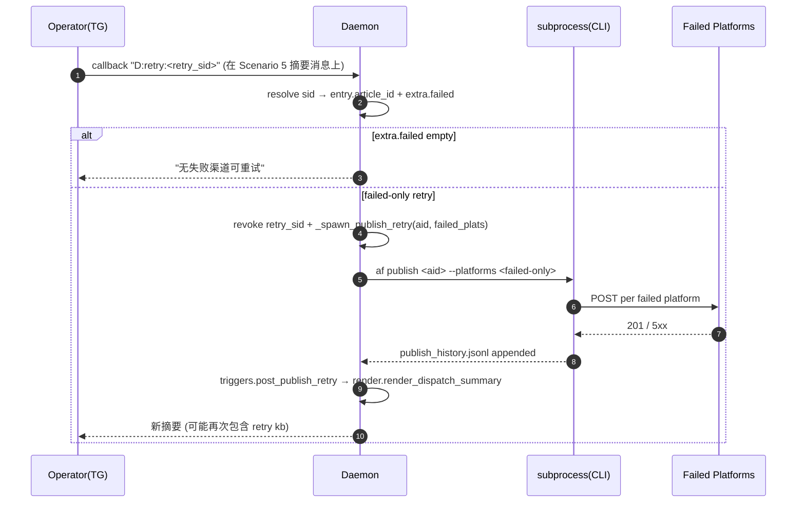

上线行为：只跑失败平台（不重试已成功的）；retry 不重发 `medium-package`，不做 state transition；每次重试都会发新摘要，若仍有失败会注册新的 12h retry short_id。retry 消息独立于原摘要，避免编辑冲突。

---

## Scenario 12 — Gate D 超时自动 cancel  `[已上线]`

> 已核对代码：`daemon._scan_timeouts()` 每 ~60s 扫 `channel_pending_review`，超过 `REVIEW_GATE_D_AUTOCANCEL_HOURS` 后 force 回 `image_approved`，发 TG 提醒，并附一次性 `D:extend:<sid>` 延长按钮。

```mermaid
sequenceDiagram
    autonumber
    participant Daemon
    participant Op as Operator(TG)
    loop 每 ~60s 心跳
        Daemon->>Daemon: _scan_timeouts()
        Daemon->>Daemon: 列出 channel_pending_review
        alt hrs >= REVIEW_GATE_D_AUTOCANCEL_HOURS (default 12h)
            Daemon->>Daemon: state.transition channel_pending_review → image_approved (force=True)
            Note over Daemon: audit.jsonl kind=timeout_auto_cancel decision=auto_cancel_timeout
            Daemon-->>Op: "Gate D 12h 未确认 → 自动 cancel" + [⏰ 再延 12h]
            alt D:extend:<sid> (max 1/article)
                Op->>Daemon: callback "D:extend:<sid>"
                Daemon->>Daemon: timeout_state.extended_count += 1; clear timeout markers
                Daemon->>Daemon: state.transition force → channel_pending_review
                Daemon->>Daemon: _spawn_gate_d(aid) 重发 Gate D 卡
            end
        end
    end
```

上线行为：倒回 `image_approved` 而非终止；TG 提醒会 mint 12h TTL 的 `D:extend` short_id。`D:extend` 每篇最多一次，复用 `timeout_state.json::extended_count`，会清 `first_pinged_at` / `second_action_taken_at` 并把状态推回 `channel_pending_review` 后重发 Gate D。`force=True` 用于 auto-cancel / extend 的回退路径。

---

## Scenario 13 — `--mode none` 跳过封面  `[已上线]`

> 已核对代码：`af image-gate <aid> --mode none` 会 transition 到 `image_skipped` 并调用 `triggers.post_gate_d()`；TG picker 的 `I:none` 也通过 daemon `_spawn_image_gate(aid, "none")` 复用同一 CLI 路径。

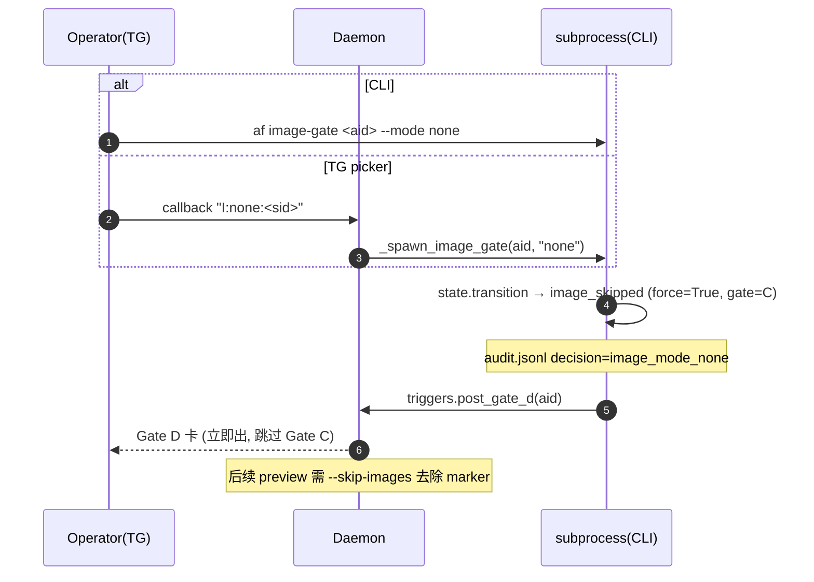

上线行为：绕过 Atlas，适合纯文渠道/紧急发布。state 会 force 到 `image_skipped`（若已是 `image_skipped` 则不重复 transition），随后自动投 Gate D 卡并返回 `gate_d_short_id`。后续 preview 仍需 `--skip-images` 去除图片 marker。

---

## Scenario N1 — Gate B：✏️ 编辑 vs 🔁 重写  `[P_]`

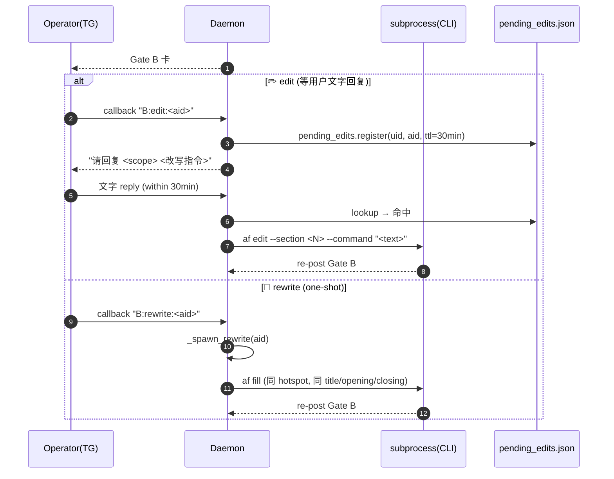

✏️ edit 走 `pending_edits.register`（30min TTL）等用户下一条文字 reply；🔁 rewrite 直接 `_spawn_rewrite` 跑 `af fill` 用同一 hotspot 重新组稿（无文字交互）。

---

## Scenario N2 — Profile 设置交互（/suggestions + P:start/later）  `[P_]`

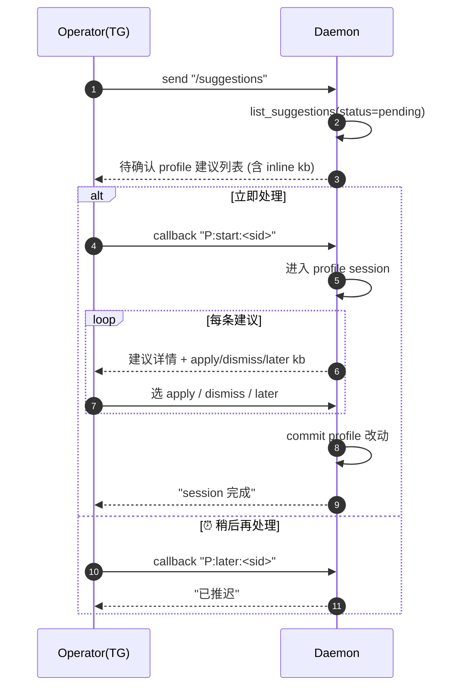

外部新加的 profile suggestion 子系统走 `daemon._handle_message` / `_route`，路由跟 review 主链平行；不影响 article state。

---

## Scenario N3 — Suggestions 审核（S:review/apply/dismiss）  `[P_]`

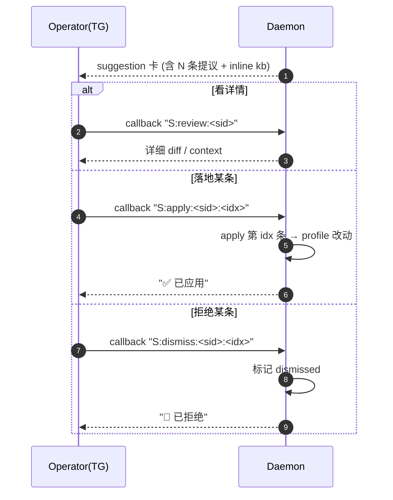

与 N2 同一外部子系统的不同入口（N2=建议汇总进 session, N3=单建议直接处理）。

---

## Scenario S0.5 — Daemon 启动 + 首次 `/start` 绑定（formerly N4）  `[P_]`

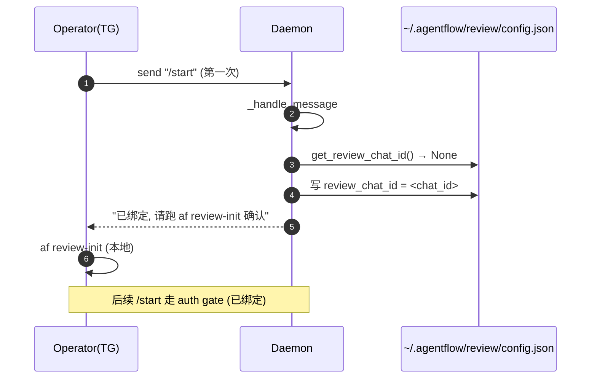

Onboarding 闭环；只发生一次；后续 /start 走 auth.py 的 per-uid 检查。S0.5 衔接 S0.6（cron 定时） + N5（手工救援）；daemon 必须先在前台或 systemd 里跑起来才能接 /start。

---

## Scenario S0.6 — Cron 定时配置  `[P_]`

```mermaid
sequenceDiagram
    autonumber
    participant User
    participant CLI as af-CLI
    participant Sched as launchd|systemd
    participant FS
    User->>CLI: af review-cron-install --times "09:00,18:00"
    alt macOS (launchd)
        CLI->>FS: 写 ~/Library/LaunchAgents/<plist>
        CLI->>Sched: launchctl load <plist>
    else Linux (systemd)
        CLI->>FS: 写 ~/.config/systemd/user/<unit>.timer + .service
        CLI->>Sched: systemctl --user enable --now <unit>.timer
        Note over CLI,Sched: 详见 INSTALL_LINUX.md §7
    end
    CLI-->>User: installed
    loop 每个时刻 (09:00, 18:00)
        Sched->>CLI: af hotspots
        Note over CLI: 链至 S1 起稿
    end
    User->>CLI: af review-cron-status
    CLI-->>User: enabled / next-fire
    opt 卸载
        User->>CLI: af review-cron-uninstall
        CLI->>Sched: unload / disable
        CLI->>FS: rm plist|unit
    end
```

注解（≤50 字）：S0.6 是 init phase 末尾自动化，不强制；不装 cron 就改成手工跑 `af hotspots` 触发 S1。

---

## Scenario N5 — 操作员手工救援（review-resume + review-post-*）  `[P_]`

```mermaid
sequenceDiagram
    autonumber
    participant Op as Operator(TG)
    participant CLI as subprocess(CLI)
    participant Daemon
    Note over Op: 自动链卡死 / state corrupted / 错过卡
    Op->>CLI: af review-resume <aid> --to-state image_approved
    CLI->>CLI: state.transition(force=True) 绕 gate
    CLI-->>Op: "state forced"
    Op->>CLI: af review-post-d <aid>
    CLI->>Daemon: triggers.post_gate_d(aid)
    Daemon-->>Op: Gate D 卡 (手工补发)
```

场景=自动链卡死时手工接管；常见触发=外部进程崩溃 / state corrupted / 错过卡。`review-post-{b,c,d}` 配套手工补发。

---

## Scenario S0.7 — Team auth 初次 grant（formerly N6）  `[P_]`

```mermaid
sequenceDiagram
    autonumber
    participant Owner as Owner Op
    participant CLI as subprocess(CLI)
    participant Auth as ~/.agentflow/review/auth.json
    participant Daemon
    participant Other as Other Op (uid)
    Owner->>CLI: af review-auth-add <uid> --actions review,edit
    CLI->>Auth: 写 grants[uid]=[review,edit]
    Other->>Daemon: send "/start"
    Daemon->>Auth: check uid 在 grants
    Daemon-->>Other: 通过 (welcome)
    Other->>Daemon: callback "B:edit:<aid>"
    Daemon->>Daemon: _route → _ACTION_REQ["B","edit"]="edit"
    Daemon->>Auth: uid 有 edit 权限 → 放行
    Owner->>CLI: af review-auth-remove <uid>
    CLI->>Auth: 删 grants[uid]
```

Operator UID（env `TELEGRAM_REVIEW_CHAT_ID`）隐式 `*` 全权限不可移除；其他 uid 通过 grant per-action（review/edit/image/publish/write）授权。S0.7 在 init phase 是 optional（单人 operator 不需要），多人值守才走；常态运维见 N5（手工救援）。

---

## 待补充场景 (placeholders for next pass)

- N7 Gate A 整批拒绝 / 24h timeout（与 R2/R3 红旗修后联动）
- N8 Weekly learning review (`af learning-review --since 7d --post-tg`)
- `<新场景：……>` 入口 ___ 触发 ___
- `<新场景：……>` 入口 ___ 触发 ___
- `<新场景：……>` 入口 ___ 触发 ___
